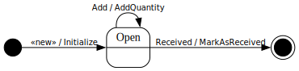

[⇦ Order Fulfillment](domain-01_order_fulfillment.md)

# Replenish Order Line

This is a request, within a specific Replenish Order, for a specified number of copies of some 
specified Print Medium. Some people would refer to this class as "Replenish Order Details."

## Attributes

| Name | Rules | Nullable | Comment |
| ---- | ----- | -------- | ------- |
| quantity | 1 .. unconstrained to the nearest whole number   | false | The number of quantities of the selected Print Medium being requested. |

## Relations

# State Machine

## State and Event Descriptions

The states for this class.

- **Open.** The line is created and can be added to.

The events for this class.

- **Add.** Add more quantity to the order line. Parameters:
   - *qty.* somewhere

- **Received.** The Publisher has received this order line.
- **«new».** Create this Replenish Order Line. Parameters:
   - *replenish order.* somewhere
   - *print medium.* somewhere
   - *qty.* somewhere

## Action Specifications

The actions for this class.

### AddQuantity(qty)

Increase the quantity of an existing order line.

Requires:

- qty > 0

Guarantees:

- post(.quanity) == pre(quantity) + qty

Triggered from:

- Add(qty)

### Initialize(replenish order, print medium, qty)

Start a new Replenish Order.

Requires:

- qty is consistent with range of .quantity

Guarantees:

- one new Replenish Order Line exists with:
    - -quantity == qty
    - this line linked to Replenish Order and Print Medium

Triggered from:

- «new»(replenish order, print medium, qty)

### MarkAsReceived()

This Print Medium has been added to the stocks.

Requires:

*None*

Guarantees:

- restock(.quantity) has been signaled for the linked Print Medium.

Triggered from:

- Received()

