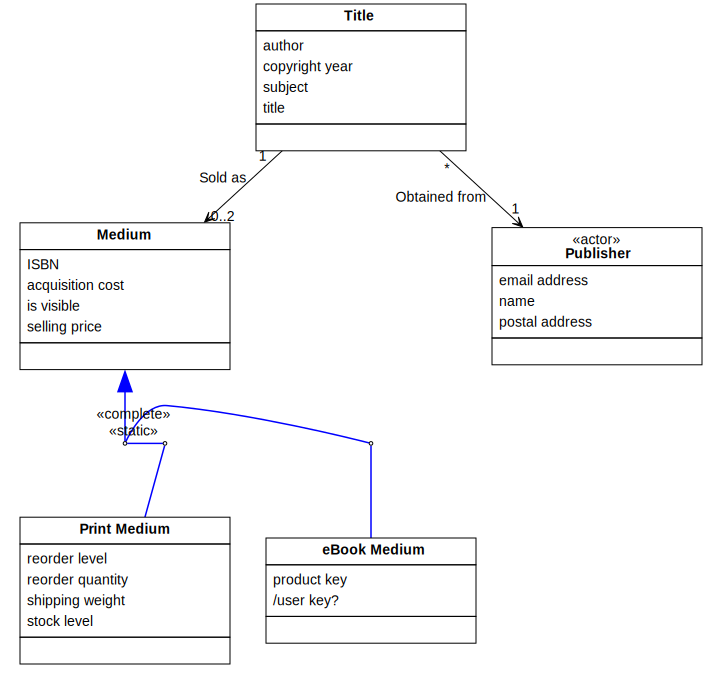
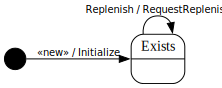

[⇦ Order Fulfillment](domain-01_order_fulfillment.md)

# Title

This class represents a specdific book being available for sale to Customers, either
in eBook or Print format, or both. Margaret Michell's classic novel "Gone
With The Wind" is an example title. The novel is available in both eBook 
and Print media. Tedchncially, each new edition of a Book is a different title,
but WebBooks doesn't are about the relationship of one edition to another, 
so they will only offer new editions as different titles that are offered for sale.

## Attributes

| Name | Rules | Nullable | Comment |
| ---- | ----- | -------- | ------- |
| author | unconstrained   | false | The name of the recognized author(s) of the work. While technically there can be many authors on a signle title and the same person can be an author on many different titles, for customer searches, a simple substring mach is sufficient so this attribute is not strictly normalized. |
| copyright year | either a whole year no earlier than 1780 and no later than this year, or public domain   | false | The year the work has copyrighted. For works that have passed out of copyright or where never copyrighted, the value will be "public domain" |
| subject | unconstrained   | false | The subject matter(s) covered in the work. While technically there can be many subjects in a single title and the same subject can apply to many different title, for customer seraches, a simple substring match is sufficient so this attribute is not strictly normalized. |
| title | unconstrained   | false | The title of the work, as assigned by the author. |

## Relations

# State Machine

## State and Event Descriptions

The states for this class.

- **Exists.** The Title is in the system.

The events for this class.

- **Replenish.** Items of the title are being added to the inventory. Parameters:
   - *print medium.* somewhere
   - *qty.* somewhere

- **«new».** Create this title. Parameters:
   - *title.* somewhere
   - *author.* somewhere
   - *subject.* somewhere
   - *year.* somewhere
   - *publisher.* somewhere

## Action Specifications

The actions for this class.

### Initialize(title, author, subject, year, publisher)

Add a new title to the system.

Requires:

- year is consistent with the range of .copyright year

Guarantees:

- one new Title exists with:
    - .title == title
    - .author == author
    - .subject == subject
    - .copyright year == year
    - this Medium linked to its Publisher via Obtained From

Triggered from:

- «new»(title, author, subject, year, publisher)

### RequestReplenish(print medium, qty)

Request more inventory.

Requires:

*None*

Guarantees:

- replenish ( Print Medium, qty) has been signaled for linked Publisher via Obtained from

Triggered from:

- Replenish(print medium, qty)

