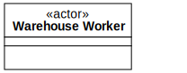

[⇦ Order Fulfillment](domain-01_order_fulfillment.md)

# Warehouse Worker

This class is an actor representing WebBooks employees who have the responsibility 
to pack and ship Book Orders involving Print media. Warehouse workers also handle the
restocking of Replenish orders as they are received. This class has no state diagram
because it is purely and actor is mostly external to the business.

## Attributes

| Name | Rules | Nullable | Comment |
| ---- | ----- | -------- | ------- |

## Relations

# State Machine

## State and Event Descriptions

The states for this class.

*None*

The events for this class.

*None*

## Action Specifications

The actions for this class.

*None*

