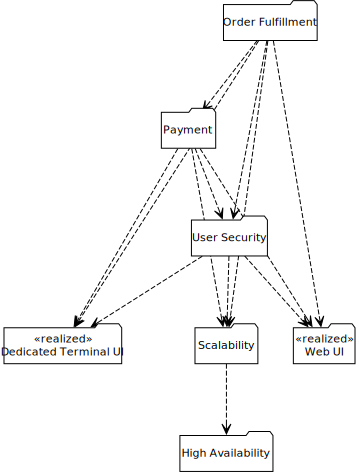

# WebBooks 2.0

WebBooks, Inc. is a mythical World Wide Web-based bookseller used as the example from How to Engineer Software, A Model-Based Approach by Steve Tockey.

## Actors

The actors of this model.

- **[Customer ](actor-customer.md).** This is an actor that represent persons or businesses that may place Book Orders with WebBooks.
- **[Manager ](actor-manager.md).** This is an actor representing WebBooks employees who have the authority 
to maintain the catalog of for-sale books, establish and modify pricing, and view 
financial summary data.
- **[Publisher ](actor-publisher.md).** This is an actor that represents external companies who publish and distribute books that WebBooks sells.
- **[Warehouse Worker ](actor-warehouse_worker.md).** This is an actor representing WebBooks employees who have the responsibility 
to pack and ship Book Orders involving Print media.

## Domains

The domains of this model.

- **[Order Fulfillment](domain-01_order_fulfillment.md).** This domain is in charge of the catalog, inventory, customers orering, shipping and receiving.
- **[Payment](domain-02_payment.md).** This domain manages all of the different forms of customer payment, including combinations of payment methods at the same time.
- **[User Security](domain-03_user_security.md).** This domain handles authorization of the different kinds of users to access different kinds of functionality.
- **[Scalability](domain-04_scalability.md).** This domain allows the system to be scaled to very large number of users.
- **[High Availability](domain-05_high_availability.md).** This domain makes sure that users can access sytem functionality as often as possible.
- **[«realized» Web UI](domain-06_web_ui.md).** This domain provides a customer interface using Web technology.
- **[«realized» Dedicated Terminal UI](domain-07_dedicated_terminal_ui.md).** This domain provides the ability to interface to a user through a private terminal (e.g. on the user's desk of suitably large tablet).

