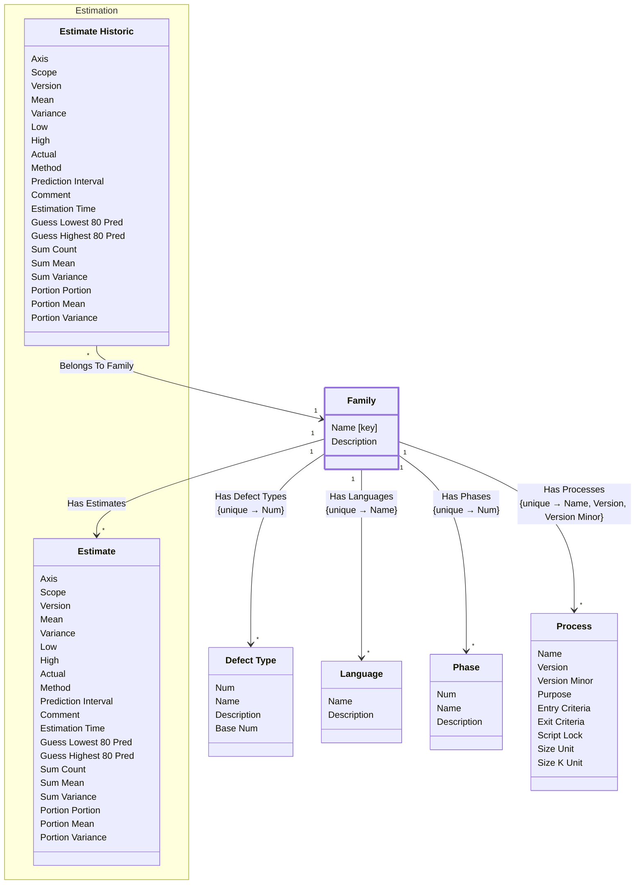

[⇦ Development Process](model.md) / [Process](domain-domain.process.md) / [Definition](subdomain-domain.process.subdomain.definition.md)

# Family

Core partitioning of the catalog. Phases, defect types, languages, processes, and estimates all belong to one family.

## Attributes

| Name | Rules | Nullable | TLA+ | Comments / Invariants |
| ---- | ----- | -------- | ---- | --------------------- |
| Name [key] | _(unparsed)_ unconstrained | false |  | Unique name of this family. |
| Description | _(unparsed)_ unconstrained | false |  | Defaults to empty when omitted. |

### Indexes

- key [Name]

## Invariants

- Phase name is unique among phases of this family.
    - **∀ p ∈ self.HasPhases : _FiniteSets!Cardinality({q ∈ self.HasPhases : q.name = p.name}) = 1**
- Defect type name is unique among defect types of this family.
    - **∀ d ∈ self.HasDefectTypes : _FiniteSets!Cardinality({q ∈ self.HasDefectTypes : q.name = d.name}) = 1**

## Relations

The classes in this diagram.

- **[Defect Type](class-domain.process.subdomain.definition.class.defect_type.md).** A type of defect classified within a process family.
- **[Estimation::Estimate](class-domain.process.subdomain.estimation.class.estimate.md).** An estimate of size or time, categorized by family, language, axis, and scope.
- **[Estimation::Estimate Historic](class-domain.process.subdomain.estimation.class.estimate_historic.md).** A stored prior iteration of an estimate.
- **[Family](class-domain.process.subdomain.definition.class.family.md).** Core partitioning of the catalog.
- **[Language](class-domain.process.subdomain.definition.class.language.md).** A programming language used when estimating size or time in a process family.
- **[Phase](class-domain.process.subdomain.definition.class.phase.md).** Fundamental phase skeleton for a process family.
- **[Process](class-domain.process.subdomain.definition.class.process.md).** A versioned process to follow, owned by a family.

# State Machine

## State and Event Descriptions

The states for this class.

*None*

The events for this class.

*None*

## Action Specifications

The actions for this class.

*None*

## Query Specifications

The queries for this class.

*None*
