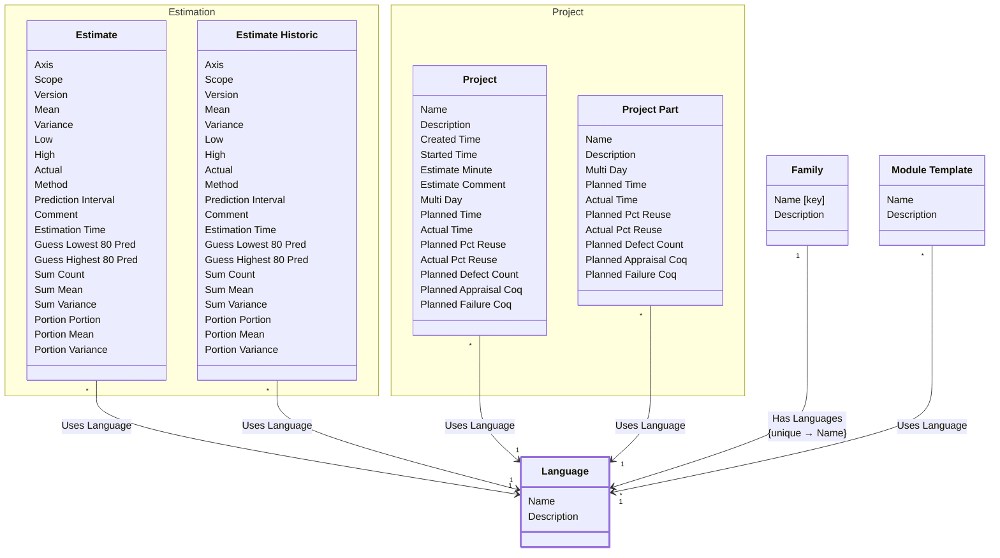

[⇦ Development Process](model.md) / [Process](domain-domain.process.md) / [Definition](subdomain-domain.process.subdomain.definition.md)

# Language

A programming language used when estimating size or time in a process family.

## Attributes

| Name | Rules | Nullable | TLA+ | Comments / Invariants |
| ---- | ----- | -------- | ---- | --------------------- |
| Name | _(unparsed)_ unconstrained | false |  | Unique among languages of the same family. |
| Description | _(unparsed)_ unconstrained | false |  |  |

## Relations

The classes in this diagram.

- **[Estimation::Estimate](class-domain.process.subdomain.estimation.class.estimate.md).** An estimate of size or time, categorized by family, language, axis, and scope.
- **[Estimation::Estimate Historic](class-domain.process.subdomain.estimation.class.estimate_historic.md).** A stored prior iteration of an estimate.
- **[Family](class-domain.process.subdomain.definition.class.family.md).** Core partitioning of the catalog.
- **[Language](class-domain.process.subdomain.definition.class.language.md).** A programming language used when estimating size or time in a process family.
- **[Module Template](class-domain.process.subdomain.definition.class.module_template.md).** Shared configuration for projects (and project parts) that follow a process.
- **[Project::Project](class-domain.process.subdomain.project.class.project.md).** Work that follows a process.
- **[Project::Project Part](class-domain.process.subdomain.project.class.project_part.md).** A language-specific part of a project.

# State Machine

## State and Event Descriptions

The states for this class.

*None*

The events for this class.

*None*

## Action Specifications

The actions for this class.

*None*

## Query Specifications

The queries for this class.

*None*
