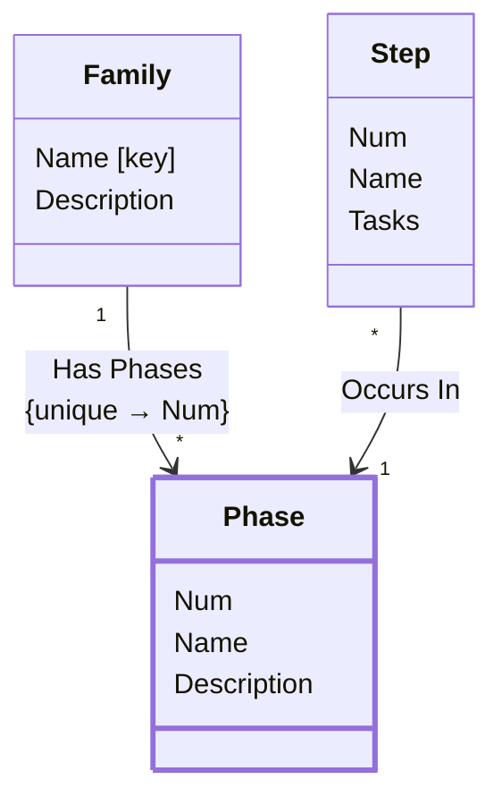

[⇦ Development Process](model.md) / [Process](domain-domain.process.md) / [Definition](subdomain-domain.process.subdomain.definition.md)

# Phase

Fundamental phase skeleton for a process family.

## Attributes

| Name | Rules | Nullable | TLA+ | Comments / Invariants |
| ---- | ----- | -------- | ---- | --------------------- |
| Num | _(unparsed)_ [0 .. unconstrained] at 1 unit | false |  | Order of this phase within the family. |
| Name | _(unparsed)_ unconstrained | false |  | Unique among phases of the same family. |
| Description | _(unparsed)_ unconstrained | false |  | Defaults to empty when omitted. |

## Relations

The classes in this diagram.

- **[Family](class-domain.process.subdomain.definition.class.family.md).** Core partitioning of the catalog.
- **[Phase](class-domain.process.subdomain.definition.class.phase.md).** Fundamental phase skeleton for a process family.
- **[Step](class-domain.process.subdomain.definition.class.step.md).** A step of a process script.

# State Machine

## State and Event Descriptions

The states for this class.

*None*

The events for this class.

*None*

## Action Specifications

The actions for this class.

*None*

## Query Specifications

The queries for this class.

*None*
