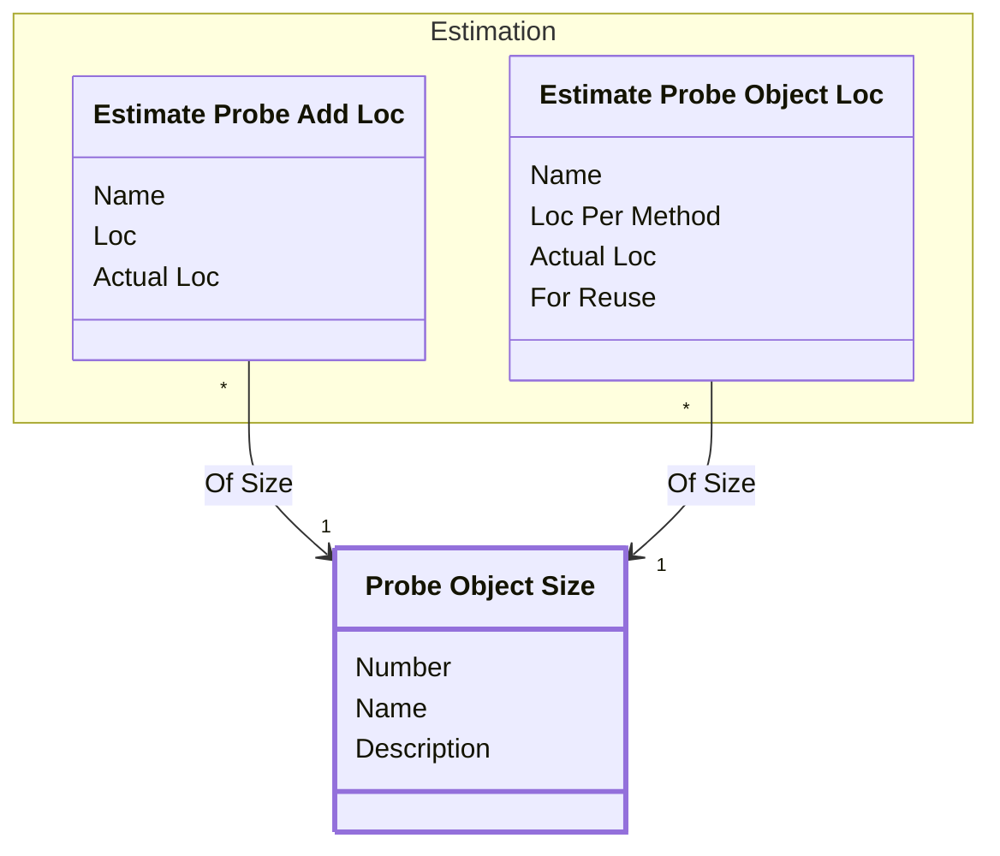

[⇦ Development Process](model.md) / [Process](domain-domain.process.md) / [Definition](subdomain-domain.process.subdomain.definition.md)

# Probe Object Size

A relative size category used when estimating objects with PROBE.

## Attributes

| Name | Rules | Nullable | TLA+ | Comments / Invariants |
| ---- | ----- | -------- | ---- | --------------------- |
| Number | _(unparsed)_ [0 .. unconstrained] at 1 unit | false |  |  |
| Name | _(unparsed)_ unconstrained | false |  |  |
| Description | _(unparsed)_ unconstrained | false |  |  |

## Relations

The classes in this diagram.

- **[Estimation::Estimate Probe Add Loc](class-domain.process.subdomain.estimation.class.estimate_probe_add_loc.md).** An added-object line in a PROBE size estimate.
- **[Estimation::Estimate Probe Object Loc](class-domain.process.subdomain.estimation.class.estimate_probe_object_loc.md).** A new-object line in a PROBE size estimate.
- **[Probe Object Size](class-domain.process.subdomain.definition.class.probe_object_size.md).** A relative size category used when estimating objects with PROBE.

# State Machine

## State and Event Descriptions

The states for this class.

*None*

The events for this class.

*None*

## Action Specifications

The actions for this class.

*None*

## Query Specifications

The queries for this class.

*None*
