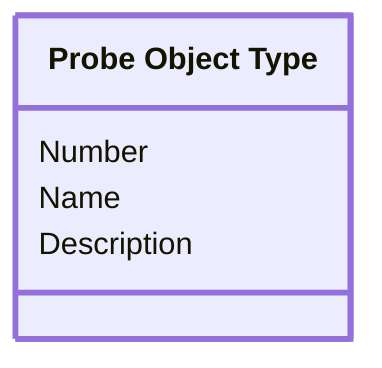

[⇦ Development Process](model.md) / [Process](domain-domain.process.md) / [Definition](subdomain-domain.process.subdomain.definition.md)

# Probe Object Type

A kind of object used when estimating with PROBE.

The commented CREATE body repeated estimate_probe columns; those calculation columns live on Estimate Probe. This class is the object-type catalog named by the DROP TABLE.

## Attributes

| Name | Rules | Nullable | TLA+ | Comments / Invariants |
| ---- | ----- | -------- | ---- | --------------------- |
| Number | _(unparsed)_ [0 .. unconstrained] at 1 unit | false |  |  |
| Name | _(unparsed)_ unconstrained | false |  |  |
| Description | _(unparsed)_ unconstrained | false |  |  |

## Relations

The classes in this diagram.

- **[Probe Object Type](class-domain.process.subdomain.definition.class.probe_object_type.md).** A kind of object used when estimating with PROBE.

# State Machine

## State and Event Descriptions

The states for this class.

*None*

The events for this class.

*None*

## Action Specifications

The actions for this class.

*None*

## Query Specifications

The queries for this class.

*None*
