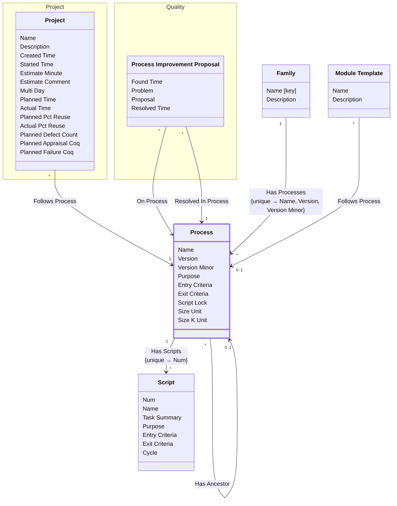

[⇦ Development Process](model.md) / [Process](domain-domain.process.md) / [Definition](subdomain-domain.process.subdomain.definition.md)

# Process

A versioned process to follow, owned by a family. May replace an earlier process as its ancestor.

## Attributes

| Name | Rules | Nullable | TLA+ | Comments / Invariants |
| ---- | ----- | -------- | ---- | --------------------- |
| Name | _(unparsed)_ unconstrained | false |  | Unique together with version and version minor within the family. |
| Version | _(unparsed)_ [0 .. unconstrained] at 1 unit | false |  | Major version of this process. |
| Version Minor | _(unparsed)_ [0 .. unconstrained] at 1 unit | false |  | Minor version of this process. Defaults to 0. |
| Purpose | _(unparsed)_ unconstrained | false |  |  |
| Entry Criteria | _(unparsed)_ unconstrained | false |  |  |
| Exit Criteria | _(unparsed)_ unconstrained | false |  |  |
| Script Lock | _(unparsed)_ enum of TRUE, FALSE | false |  | When TRUE, scripts of this process are locked. Defaults to FALSE. |
| Size Unit | _(unparsed)_ unconstrained | false |  | Unit used for size, such as LOC or word. |
| Size K Unit | _(unparsed)_ unconstrained | false |  | Unit used for thousands of size, such as KLOC. |

## Invariants

- Script name is unique among scripts of this process.
    - **∀ s ∈ self.HasScripts : _FiniteSets!Cardinality({q ∈ self.HasScripts : q.name = s.name}) = 1**

## Relations

The classes in this diagram.

- **[Family](class-domain.process.subdomain.definition.class.family.md).** Core partitioning of the catalog.
- **[Module Template](class-domain.process.subdomain.definition.class.module_template.md).** Shared configuration for projects (and project parts) that follow a process.
- **[Process](class-domain.process.subdomain.definition.class.process.md).** A versioned process to follow, owned by a family.
- **[Quality::Process Improvement Proposal](class-domain.process.subdomain.quality.class.pip.md).** A process improvement proposal raised on a project.
- **[Project::Project](class-domain.process.subdomain.project.class.project.md).** Work that follows a process.
- **[Script](class-domain.process.subdomain.definition.class.script.md).** A step-by-step process script owned by a process.

# State Machine

## State and Event Descriptions

The states for this class.

*None*

The events for this class.

*None*

## Action Specifications

The actions for this class.

*None*

## Query Specifications

The queries for this class.

*None*
