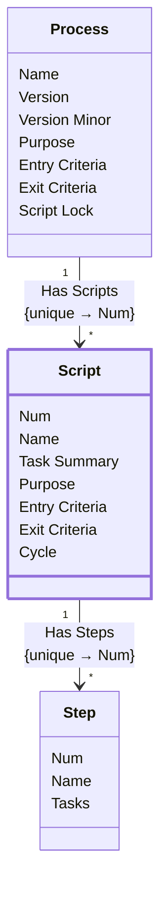

[⇦ Development Process](model.md) / [Process](domain-domain.process.md) / [Definition](subdomain-domain.process.subdomain.definition.md)

# Script

A step-by-step process script owned by a process.

## Attributes

| Name | Rules | Nullable | TLA+ | Comments / Invariants |
| ---- | ----- | -------- | ---- | --------------------- |
| Num | _(unparsed)_ [0 .. unconstrained] at 1 unit | false |  | Order of this script within the process. |
| Name | _(unparsed)_ unconstrained | false |  | Unique among scripts of the same process. |
| Task Summary | _(unparsed)_ unconstrained | false |  |  |
| Purpose | _(unparsed)_ unconstrained | false |  |  |
| Entry Criteria | _(unparsed)_ unconstrained | false |  |  |
| Exit Criteria | _(unparsed)_ unconstrained | false |  |  |
| Cycle | _(unparsed)_ enum of TRUE, FALSE | false |  | Whether this script is a cycle. Defaults to FALSE. |

## Invariants

- Step name is unique among steps of this script.
    - **∀ s ∈ self.HasSteps : _FiniteSets!Cardinality({q ∈ self.HasSteps : q.name = s.name}) = 1**

## Relations

The classes in this diagram.

- **[Process](class-domain.process.subdomain.definition.class.process.md).** A versioned process to follow, owned by a family.
- **[Script](class-domain.process.subdomain.definition.class.script.md).** A step-by-step process script owned by a process.
- **[Step](class-domain.process.subdomain.definition.class.step.md).** A step of a process script.

# State Machine

## State and Event Descriptions

The states for this class.

*None*

The events for this class.

*None*

## Action Specifications

The actions for this class.

*None*

## Query Specifications

The queries for this class.

*None*
