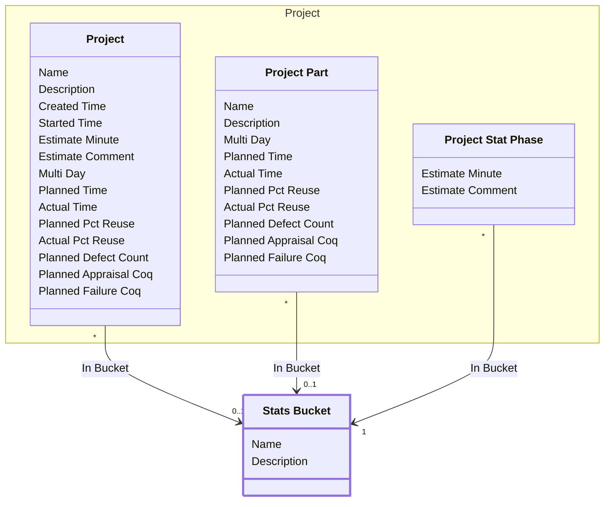

[⇦ Development Process](model.md) / [Process](domain-domain.process.md) / [Definition](subdomain-domain.process.subdomain.definition.md)

# Stats Bucket

A bucket used to group project statistics.

## Attributes

| Name | Rules | Nullable | TLA+ | Comments / Invariants |
| ---- | ----- | -------- | ---- | --------------------- |
| Name | _(unparsed)_ unconstrained | false |  |  |
| Description | _(unparsed)_ unconstrained | false |  |  |

## Relations

The classes in this diagram.

- **[Project::Project](class-domain.process.subdomain.project.class.project.md).** Work that follows a process.
- **[Project::Project Part](class-domain.process.subdomain.project.class.project_part.md).** A language-specific part of a project.
- **[Project::Project Stat Phase](class-domain.process.subdomain.project.class.project_stat_phase.md).** A per-phase statistical estimate on a project. stat_phase is Phase; bucket is Stats Bucket.
- **[Stats Bucket](class-domain.process.subdomain.definition.class.stats_bucket.md).** A bucket used to group project statistics.

# State Machine

## State and Event Descriptions

The states for this class.

*None*

The events for this class.

*None*

## Action Specifications

The actions for this class.

*None*

## Query Specifications

The queries for this class.

*None*
