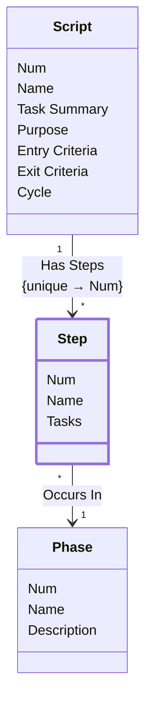

[⇦ Development Process](model.md) / [Process](domain-domain.process.md) / [Definition](subdomain-domain.process.subdomain.definition.md)

# Step

A step of a process script. Every step occurs in a phase of the same family as its process.

## Attributes

| Name | Rules | Nullable | TLA+ | Comments / Invariants |
| ---- | ----- | -------- | ---- | --------------------- |
| Num | _(unparsed)_ [0 .. unconstrained] at 1 unit | false |  | Order of this step within the script. |
| Name | _(unparsed)_ unconstrained | false |  | Unique among steps of the same script. |
| Tasks | _(unparsed)_ unconstrained | false |  | Work performed in this step. |

## Invariants

- The phase of a step belongs to the same family as the process that owns the script.
    - **LET script == CHOOSE s ∈ self._HasSteps : TRUE IN LET process == CHOOSE p ∈ script._HasScripts : TRUE IN LET familyFromProcess == CHOOSE f ∈ process._HasProcesses : TRUE IN LET phase == CHOOSE ph ∈ self.OccursIn : TRUE IN LET familyFromPhase == CHOOSE f ∈ phase._HasPhases : TRUE IN familyFromProcess = familyFromPhase**

## Relations

The classes in this diagram.

- **[Phase](class-domain.process.subdomain.definition.class.phase.md).** Fundamental phase skeleton for a process family.
- **[Script](class-domain.process.subdomain.definition.class.script.md).** A step-by-step process script owned by a process.
- **[Step](class-domain.process.subdomain.definition.class.step.md).** A step of a process script.

# State Machine

## State and Event Descriptions

The states for this class.

*None*

The events for this class.

*None*

## Action Specifications

The actions for this class.

*None*

## Query Specifications

The queries for this class.

*None*
