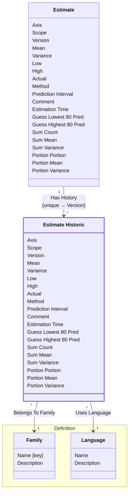

[⇦ Development Process](model.md) / [Process](domain-domain.process.md) / [Estimation](subdomain-domain.process.subdomain.estimation.md)

# Estimate Historic

A stored prior iteration of an estimate. Family and language are denormalized from the estimate they snapshot and must match it.

## Attributes

| Name | Rules | Nullable | TLA+ | Comments / Invariants |
| ---- | ----- | -------- | ---- | --------------------- |
| Axis | _(unparsed)_ enum of size, time | false |  | Whether this snapshot is of size or time. |
| Scope | _(unparsed)_ enum of project, phase, cycle, proxy, added, modified, deleted | false |  | How the snapshot is categorized. |
| Version | _(unparsed)_ [1 .. unconstrained] at 1 unit | false |  | Version of the estimate this snapshot captured. Unique together with the estimate. |
| Mean | _(unparsed)_ [unconstrained .. unconstrained] at 0.01 unit | false |  | The middle of the estimate bell curve. |
| Variance | _(unparsed)_ [0 .. unconstrained] at 0.01 unit | false |  | The shape of the estimate bell curve. |
| Low | _(unparsed)_ [unconstrained .. unconstrained] at 0.01 unit | false |  | Lowest estimate based on the prediction interval. |
| High | _(unparsed)_ [unconstrained .. unconstrained] at 0.01 unit | false |  | Highest estimate based on the prediction interval. |
| Actual | _(unparsed)_ [0 .. unconstrained] at 1 unit | false |  | Value recorded when work completed. Defaults to 0. |
| Method | _(unparsed)_ enum of guess, sum, portion | false |  | How the estimate was computed. Guess, sum, and portion each use their own fields. |
| Prediction Interval | _(unparsed)_ [0 .. 1] at 0.01 fraction | false |  | High/low range of interest, from 0 to 1. |
| Comment | _(unparsed)_ unconstrained | false |  | Note about how the estimate was computed. |
| Estimation Time | _(unparsed)_ datetime | false |  | When the estimate was made. |
| Guess Lowest 80 Pred | _(unparsed)_ [0 .. unconstrained] at 1 unit | true |  | Lowest expected value at an 80 percent prediction interval. Used only by a guess estimate. |
| Guess Highest 80 Pred | _(unparsed)_ [0 .. unconstrained] at 1 unit | true |  | Highest expected value at an 80 percent prediction interval. Used only by a guess estimate. |
| Sum Count | _(unparsed)_ [0 .. unconstrained] at 1 unit | true |  | Number of inputs into a sum estimate. |
| Sum Mean | _(unparsed)_ [unconstrained .. unconstrained] at 0.01 unit | true |  | Middle of the summed estimate bell curve. |
| Sum Variance | _(unparsed)_ [0 .. unconstrained] at 0.01 unit | true |  | Shape of the summed estimate bell curve. |
| Portion Portion | _(unparsed)_ [0 .. 1] at 0.01 fraction | true |  | Fraction of the original value, from 0 to 1. Used only by a portion estimate. |
| Portion Mean | _(unparsed)_ [unconstrained .. unconstrained] at 0.01 unit | true |  | Middle of the portion estimate bell curve. |
| Portion Variance | _(unparsed)_ [0 .. unconstrained] at 0.01 unit | true |  | Shape of the portion estimate bell curve. |

## Invariants

- The family of a historic snapshot is the family of the estimate it snapshots.
    - **LET estimate == CHOOSE e ∈ self._HasHistory : TRUE IN self.BelongsToFamily = estimate._HasEstimates**
- The language of a historic snapshot is the language of the estimate it snapshots.
    - **LET estimate == CHOOSE e ∈ self._HasHistory : TRUE IN self.UsesLanguage = estimate.UsesLanguage**
- The language of a historic snapshot belongs to the same family as the snapshot.
    - **LET lang == CHOOSE l ∈ self.UsesLanguage : TRUE IN LET family == CHOOSE f ∈ self.BelongsToFamily : TRUE IN lang ∈ family.HasLanguages**
- Guess-only fields are set only when the method is guess.
    - **self.Method = "guess" ∨ self.GuessLowest80Pred = {} ∧ self.GuessHighest80Pred = {}**
- Sum-only fields are set only when the method is sum.
    - **self.Method = "sum" ∨ self.SumCount = {} ∧ self.SumMean = {} ∧ self.SumVariance = {}**
- Portion-only fields are set only when the method is portion.
    - **self.Method = "portion" ∨ self.PortionPortion = {} ∧ self.PortionMean = {} ∧ self.PortionVariance = {}**

## Relations

The classes in this diagram.

- **[Estimate](class-domain.process.subdomain.estimation.class.estimate.md).** An estimate of size or time, categorized by family, language, axis, and scope.
- **[Estimate Historic](class-domain.process.subdomain.estimation.class.estimate_historic.md).** A stored prior iteration of an estimate.
- **[Definition::Family](class-domain.process.subdomain.definition.class.family.md).** Core partitioning of the catalog.
- **[Definition::Language](class-domain.process.subdomain.definition.class.language.md).** A programming language used when estimating size or time in a process family.

# State Machine

## State and Event Descriptions

The states for this class.

*None*

The events for this class.

*None*

## Action Specifications

The actions for this class.

*None*

## Query Specifications

The queries for this class.

*None*
