[⇦ Development Process](model.md) / [Process](domain-domain.process.md) / [Project](subdomain-domain.process.subdomain.project.md)

# Project

Work that follows a process. The two commented project drafts are one class: instance fields from the first draft and planning fields from the second.

## Attributes

| Name | Rules | Nullable | TLA+ | Comments / Invariants |
| ---- | ----- | -------- | ---- | --------------------- |
| Name | _(unparsed)_ unconstrained | false |  |  |
| Description | _(unparsed)_ unconstrained | false |  |  |
| Created Time | _(unparsed)_ datetime | false |  |  |
| Started Time | _(unparsed)_ datetime | true |  | Empty when the project has not started. |
| Estimate Minute | _(unparsed)_ [0 .. unconstrained] at 1 minute | false |  | Defaults to 0. |
| Estimate Comment | _(unparsed)_ unconstrained | false |  | Defaults to empty. |
| Multi Day | _(unparsed)_ enum of TRUE, FALSE | false |  | SQL column mutli_day. |
| Planned Time | _(unparsed)_ [0 .. unconstrained] at 1 unit | false |  |  |
| Actual Time | _(unparsed)_ [0 .. unconstrained] at 1 unit | false |  |  |
| Planned Pct Reuse | _(unparsed)_ [0 .. 100] at 1 percent | false |  |  |
| Actual Pct Reuse | _(unparsed)_ [0 .. 100] at 1 percent | false |  |  |
| Planned Defect Count | _(unparsed)_ [0 .. unconstrained] at 1 unit | false |  |  |
| Planned Appraisal Coq | _(unparsed)_ [0 .. unconstrained] at 1 unit | false |  |  |
| Planned Failure Coq | _(unparsed)_ [0 .. unconstrained] at 1 unit | false |  |  |

## Relations

The classes in this diagram.

```mermaid
---
config:
  class:
    hideEmptyMembersBox: true
---
classDiagram
class class_domain_process_subdomain_project_class_phase_products_check["Phase Products Check"] {
        Satisfied
    }
class class_domain_process_subdomain_project_class_project["Project"] {
        Name
        Description
        Created Time
        Started Time
        Estimate Minute
        Estimate Comment
        Multi Day
        Planned Time
        Actual Time
        Planned Pct Reuse
        Actual Pct Reuse
        Planned Defect Count
        Planned Appraisal Coq
        Planned Failure Coq
    }
class class_domain_process_subdomain_project_class_project_cycle_actual["Project Cycle Actual"] {
        Num
        Actual Pct Reuse
    }
class class_domain_process_subdomain_project_class_project_cycle_plan["Project Cycle Plan"] {
        Num
        Planned Pct Reuse
    }
class class_domain_process_subdomain_project_class_project_part["Project Part"] {
        Name
        Description
        Multi Day
        Planned Time
        Actual Time
        Planned Pct Reuse
        Actual Pct Reuse
        Planned Defect Count
        Planned Appraisal Coq
        Planned Failure Coq
    }
class class_domain_process_subdomain_project_class_project_stat_phase["Project Stat Phase"] {
        Estimate Minute
        Estimate Comment
    }
class class_domain_process_subdomain_project_class_schedule["Schedule"] {
        Day Or Week
    }
class class_domain_process_subdomain_project_class_schedule_week["Schedule Week"] {
        Num
        Date Monday
    }
class class_domain_process_subdomain_project_class_task["Task"] {
        Num
        Name
        Planned Hours
        Pct Complete
    }
class class_domain_process_subdomain_project_class_time_log["Time Log"] {
        Cycle
        Start Time
        Stop Time
        Interruption Minutes
        Comments
    }
namespace Definition {
class class_domain_process_subdomain_definition_class_design_method["Design Method"] {
            Name
            Description
        }
class class_domain_process_subdomain_definition_class_language["Language"] {
            Name
            Description
        }
class class_domain_process_subdomain_definition_class_method["Method"] {
            Name [key]
            Description
        }
class class_domain_process_subdomain_definition_class_module_template["Module Template"] {
            Name
            Description
        }
class class_domain_process_subdomain_definition_class_phase["Phase"] {
            Num
            Name
            Description
        }
class class_domain_process_subdomain_definition_class_process["Process"] {
            Name
            Version
            Version Minor
            Purpose
            Entry Criteria
            Exit Criteria
            Script Lock
            Size Unit
            Size K Unit
        }
class class_domain_process_subdomain_definition_class_stats_bucket["Stats Bucket"] {
            Name
            Description
        }
class class_domain_process_subdomain_definition_class_step["Step"] {
            Num
            Name
            Tasks
        }
}
namespace Estimation {
class class_domain_process_subdomain_estimation_class_actual_loc["Actual Loc"] {
            Cycle
            Base
            New
            Changed
            Added
            Modified
            Deleted
            Reused
            Object Loc
        }
class class_domain_process_subdomain_estimation_class_estimate_loc["Estimate Loc"] {
            Base
            New
            Changed
            Added
            Modified
            Deleted
            Reused
            Object Loc
        }
class class_domain_process_subdomain_estimation_class_estimate_probe["Estimate Probe"] {
            Base Loc
            Deleted Loc
            Modified Loc
            B0 Size
            B1 Size
            B0 Time
            B1 Time
            New Loc
            New Reuse Loc
            Estimated Time Min
            Upper Prediction Interval
            Lower Prediction Interval
            Prediction Interval Percent
            Actual Base Loc
            Actual Deleted Loc
            Actual Modified Loc
            Loc Upper Prediction Interval 70
            Loc Lower Prediction Interval 70
            Time Upper Prediction Interval 70
            Time Lower Prediction Interval 70
        }
class class_domain_process_subdomain_estimation_class_estimate_probe_add_loc["Estimate Probe Add Loc"] {
            Name
            Loc
            Actual Loc
        }
class class_domain_process_subdomain_estimation_class_estimate_probe_object_loc["Estimate Probe Object Loc"] {
            Name
            Loc Per Method
            Actual Loc
            For Reuse
        }
class class_domain_process_subdomain_estimation_class_estimate_probe_object_reused["Estimate Probe Object Reused"] {
            Name
            Loc
            Actual Loc
        }
}
namespace Quality {
class class_domain_process_subdomain_quality_class_defect["Defect"] {
            Found Time
            Cycle
            Fix Minutes
            Description
        }
class class_domain_process_subdomain_quality_class_issue["Issue"] {
            Found Time
            Cycle
            Description
            Resolution Time
            Resolution
        }
class class_domain_process_subdomain_quality_class_pip["Process Improvement Proposal"] {
            Found Time
            Problem
            Proposal
            Resolved Time
        }
class class_domain_process_subdomain_quality_class_test_case["Test Case"] {
            Found Time
            Objective
            Description
            Conditions
            Expected
        }
class class_domain_process_subdomain_quality_class_test_case_result["Test Case Result"] {
            Run Time
            Actual
        }
}
style class_domain_process_subdomain_project_class_project stroke:#9370DB,stroke-width:3px
class assoc_domain_process_cassociation_subdomain_project_class_project_subdomain_definition_class_phase_checks_phase_products["Checks Phase Products"]
<<association>> assoc_domain_process_cassociation_subdomain_project_class_project_subdomain_definition_class_phase_checks_phase_products
class assoc_domain_process_cassociation_subdomain_project_class_project_subdomain_definition_class_phase_has_probe_estimate_for["Has Probe Estimate For"]
<<association>> assoc_domain_process_cassociation_subdomain_project_class_project_subdomain_definition_class_phase_has_probe_estimate_for
style assoc_domain_process_cassociation_subdomain_project_class_project_subdomain_definition_class_phase_checks_phase_products stroke:#333,stroke-dasharray:5 5
style assoc_domain_process_cassociation_subdomain_project_class_project_subdomain_definition_class_phase_has_probe_estimate_for stroke:#333,stroke-dasharray:5 5
class_domain_process_subdomain_project_class_project "*" --> "1" class_domain_process_subdomain_definition_class_design_method : Uses Design Method
class_domain_process_subdomain_project_class_project "*" --> "1" class_domain_process_subdomain_definition_class_language : Uses Language
class_domain_process_subdomain_project_class_project "*" --> "1" class_domain_process_subdomain_definition_class_method : Uses Size Estimation Method
class_domain_process_subdomain_project_class_project "*" --> "1" class_domain_process_subdomain_definition_class_method : Uses Time Estimation Method
class_domain_process_subdomain_project_class_project "*" --> "1" class_domain_process_subdomain_definition_class_module_template : Instantiates
class_domain_process_subdomain_project_class_project "*" -- assoc_domain_process_cassociation_subdomain_project_class_project_subdomain_definition_class_phase_checks_phase_products
    assoc_domain_process_cassociation_subdomain_project_class_project_subdomain_definition_class_phase_checks_phase_products --> "*" class_domain_process_subdomain_definition_class_phase
    class_domain_process_subdomain_project_class_phase_products_check .. assoc_domain_process_cassociation_subdomain_project_class_project_subdomain_definition_class_phase_checks_phase_products
class_domain_process_subdomain_project_class_project "*" --> "0..1" class_domain_process_subdomain_definition_class_phase : Current Phase
class_domain_process_subdomain_project_class_project "1" -- assoc_domain_process_cassociation_subdomain_project_class_project_subdomain_definition_class_phase_has_probe_estimate_for
    assoc_domain_process_cassociation_subdomain_project_class_project_subdomain_definition_class_phase_has_probe_estimate_for --> "*" class_domain_process_subdomain_definition_class_phase
    class_domain_process_subdomain_estimation_class_estimate_probe .. assoc_domain_process_cassociation_subdomain_project_class_project_subdomain_definition_class_phase_has_probe_estimate_for
class_domain_process_subdomain_project_class_project "*" --> "1" class_domain_process_subdomain_definition_class_process : Follows Process
class_domain_process_subdomain_project_class_project "*" --> "0..1" class_domain_process_subdomain_definition_class_stats_bucket : In Bucket
class_domain_process_subdomain_project_class_project "*" --> "0..1" class_domain_process_subdomain_definition_class_step : Current Subphase
class_domain_process_subdomain_project_class_project "1" --> "0..1" class_domain_process_subdomain_estimation_class_actual_loc : Has Actual Loc
class_domain_process_subdomain_project_class_project "1" --> "0..1" class_domain_process_subdomain_estimation_class_estimate_loc : Has Loc Estimate
class_domain_process_subdomain_project_class_project "1" --> "*" class_domain_process_subdomain_estimation_class_estimate_probe_add_loc : Has Probe Add Loc
class_domain_process_subdomain_project_class_project "1" --> "*" class_domain_process_subdomain_estimation_class_estimate_probe_object_loc : Has Probe Object Loc
class_domain_process_subdomain_project_class_project "1" --> "*" class_domain_process_subdomain_estimation_class_estimate_probe_object_reused : Has Probe Object Reused
class_domain_process_subdomain_quality_class_defect "*" --> "1" class_domain_process_subdomain_project_class_project : Injected In
class_domain_process_subdomain_quality_class_defect "*" --> "1" class_domain_process_subdomain_project_class_project : Removed In
class_domain_process_subdomain_quality_class_issue "*" --> "1" class_domain_process_subdomain_project_class_project : Injected In
class_domain_process_subdomain_quality_class_pip "*" --> "1" class_domain_process_subdomain_project_class_project : On Project
class_domain_process_subdomain_quality_class_test_case "*" --> "1" class_domain_process_subdomain_project_class_project : For Project
class_domain_process_subdomain_quality_class_test_case_result "*" --> "1" class_domain_process_subdomain_project_class_project : For Project
class_domain_process_subdomain_project_class_project "1" --> "*" class_domain_process_subdomain_project_class_project_cycle_actual : Has Cycle Actuals<br/>{unique → Num}
class_domain_process_subdomain_project_class_project "1" --> "*" class_domain_process_subdomain_project_class_project_cycle_plan : Has Cycle Plans<br/>{unique → Num}
class_domain_process_subdomain_project_class_project "1" --> "*" class_domain_process_subdomain_project_class_project_part : Has Parts
class_domain_process_subdomain_project_class_project "1" --> "*" class_domain_process_subdomain_project_class_project_stat_phase : Has Stat Phases
class_domain_process_subdomain_project_class_project "1" --> "0..1" class_domain_process_subdomain_project_class_schedule : Has Schedule
class_domain_process_subdomain_project_class_project "1" --> "*" class_domain_process_subdomain_project_class_task : Has Tasks
class_domain_process_subdomain_project_class_project "1" --> "*" class_domain_process_subdomain_project_class_time_log : Has Time Logs
class_domain_process_subdomain_project_class_schedule_week "*" --> "1" class_domain_process_subdomain_project_class_project : For Project

```

- **[Estimation::Actual Loc](class-domain.process.subdomain.estimation.class.actual_loc.md).** Actual lines-of-code account for a project.
- **[Quality::Defect](class-domain.process.subdomain.quality.class.defect.md).** A defect injected and removed in projects and phases.
- **[Definition::Design Method](class-domain.process.subdomain.definition.class.design_method.md).** A design template used when planning a project or module.
- **[Estimation::Estimate Loc](class-domain.process.subdomain.estimation.class.estimate_loc.md).** Planned lines-of-code account for a project.
- **[Estimation::Estimate Probe](class-domain.process.subdomain.estimation.class.estimate_probe.md).** PROBE size and time calculation for a project in a phase.
- **[Estimation::Estimate Probe Add Loc](class-domain.process.subdomain.estimation.class.estimate_probe_add_loc.md).** An added-object line in a PROBE size estimate.
- **[Estimation::Estimate Probe Object Loc](class-domain.process.subdomain.estimation.class.estimate_probe_object_loc.md).** A new-object line in a PROBE size estimate.
- **[Estimation::Estimate Probe Object Reused](class-domain.process.subdomain.estimation.class.estimate_probe_object_reused.md).** A reused-object line in a PROBE size estimate.
- **[Quality::Issue](class-domain.process.subdomain.quality.class.issue.md).** An issue found in a project phase, with an optional resolution.
- **[Definition::Language](class-domain.process.subdomain.definition.class.language.md).** A programming language used when estimating size or time in a process family.
- **[Definition::Method](class-domain.process.subdomain.definition.class.method.md).** A programming method used when recording phase statistics for a project.
- **[Definition::Module Template](class-domain.process.subdomain.definition.class.module_template.md).** Shared configuration for projects (and project parts) that follow a process.
- **[Definition::Phase](class-domain.process.subdomain.definition.class.phase.md).** Fundamental phase skeleton for a process family.
- **[Phase Products Check](class-domain.process.subdomain.project.class.phase_products_check.md).** Whether a project's products for a phase are satisfied.
- **[Definition::Process](class-domain.process.subdomain.definition.class.process.md).** A versioned process to follow, owned by a family.
- **[Quality::Process Improvement Proposal](class-domain.process.subdomain.quality.class.pip.md).** A process improvement proposal raised on a project.
- **[Project](class-domain.process.subdomain.project.class.project.md).** Work that follows a process.
- **[Project Cycle Actual](class-domain.process.subdomain.project.class.project_cycle_actual.md).** Actual recording values for one cycle of a project.
- **[Project Cycle Plan](class-domain.process.subdomain.project.class.project_cycle_plan.md).** Planned recording values for one cycle of a project.
- **[Project Part](class-domain.process.subdomain.project.class.project_part.md).** A language-specific part of a project.
- **[Project Stat Phase](class-domain.process.subdomain.project.class.project_stat_phase.md).** A per-phase statistical estimate on a project. stat_phase is Phase; bucket is Stats Bucket.
- **[Schedule](class-domain.process.subdomain.project.class.schedule.md).** The planned calendar for a project, in days or weeks.
- **[Schedule Week](class-domain.process.subdomain.project.class.schedule_week.md).** One week (or day slot) on a project schedule.
- **[Definition::Stats Bucket](class-domain.process.subdomain.definition.class.stats_bucket.md).** A bucket used to group project statistics.
- **[Definition::Step](class-domain.process.subdomain.definition.class.step.md).** A step of a process script.
- **[Task](class-domain.process.subdomain.project.class.task.md).** A planned task on a project, assigned to a phase and a schedule week.
- **[Quality::Test Case](class-domain.process.subdomain.quality.class.test_case.md).** A test case defined for a project.
- **[Quality::Test Case Result](class-domain.process.subdomain.quality.class.test_case_result.md).** A recorded run of a test case.
- **[Time Log](class-domain.process.subdomain.project.class.time_log.md).** A recorded interval of work on a project.

# State Machine

## State and Event Descriptions

The states for this class.

*None*

The events for this class.

*None*

## Action Specifications

The actions for this class.

*None*

## Query Specifications

The queries for this class.

*None*
