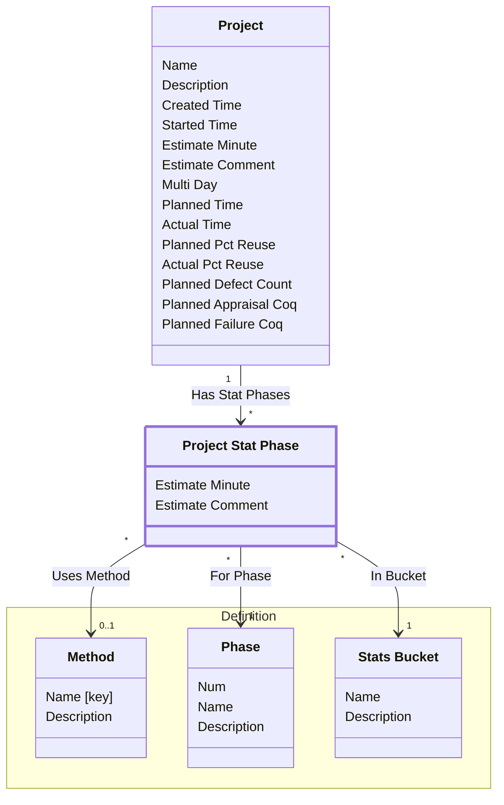

[⇦ Development Process](model.md) / [Process](domain-domain.process.md) / [Project](subdomain-domain.process.subdomain.project.md)

# Project Stat Phase

A per-phase statistical estimate on a project. stat_phase is Phase; bucket is Stats Bucket.

## Attributes

| Name | Rules | Nullable | TLA+ | Comments / Invariants |
| ---- | ----- | -------- | ---- | --------------------- |
| Estimate Minute | _(unparsed)_ [0 .. unconstrained] at 1 minute | false |  | Defaults to 0. |
| Estimate Comment | _(unparsed)_ unconstrained | false |  | Defaults to empty. |

## Relations

The classes in this diagram.

- **[Definition::Method](class-domain.process.subdomain.definition.class.method.md).** A programming method used when recording phase statistics for a project.
- **[Definition::Phase](class-domain.process.subdomain.definition.class.phase.md).** Fundamental phase skeleton for a process family.
- **[Project](class-domain.process.subdomain.project.class.project.md).** Work that follows a process.
- **[Project Stat Phase](class-domain.process.subdomain.project.class.project_stat_phase.md).** A per-phase statistical estimate on a project. stat_phase is Phase; bucket is Stats Bucket.
- **[Definition::Stats Bucket](class-domain.process.subdomain.definition.class.stats_bucket.md).** A bucket used to group project statistics.

# State Machine

## State and Event Descriptions

The states for this class.

*None*

The events for this class.

*None*

## Action Specifications

The actions for this class.

*None*

## Query Specifications

The queries for this class.

*None*
