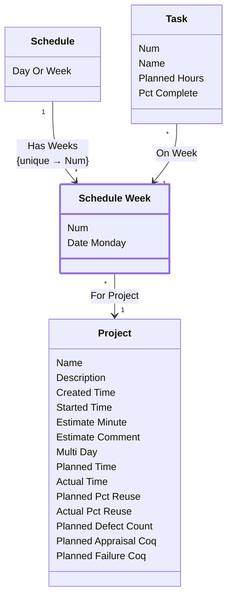

[⇦ Development Process](model.md) / [Process](domain-domain.process.md) / [Project](subdomain-domain.process.subdomain.project.md)

# Schedule Week

One week (or day slot) on a project schedule.

## Attributes

| Name | Rules | Nullable | TLA+ | Comments / Invariants |
| ---- | ----- | -------- | ---- | --------------------- |
| Num | _(unparsed)_ [0 .. unconstrained] at 1 unit | false |  | Order of this week on the schedule. |
| Date Monday | _(unparsed)_ datetime | false |  | Monday of this schedule week. |

## Invariants

- The project of a schedule week is the project of its schedule.
    - **LET schedule == CHOOSE s ∈ self._HasWeeks : TRUE IN self.ForProject = schedule._HasSchedule**

## Relations

The classes in this diagram.

- **[Project](class-domain.process.subdomain.project.class.project.md).** Work that follows a process.
- **[Schedule](class-domain.process.subdomain.project.class.schedule.md).** The planned calendar for a project, in days or weeks.
- **[Schedule Week](class-domain.process.subdomain.project.class.schedule_week.md).** One week (or day slot) on a project schedule.
- **[Task](class-domain.process.subdomain.project.class.task.md).** A planned task on a project, assigned to a phase and a schedule week.

# State Machine

## State and Event Descriptions

The states for this class.

*None*

The events for this class.

*None*

## Action Specifications

The actions for this class.

*None*

## Query Specifications

The queries for this class.

*None*
