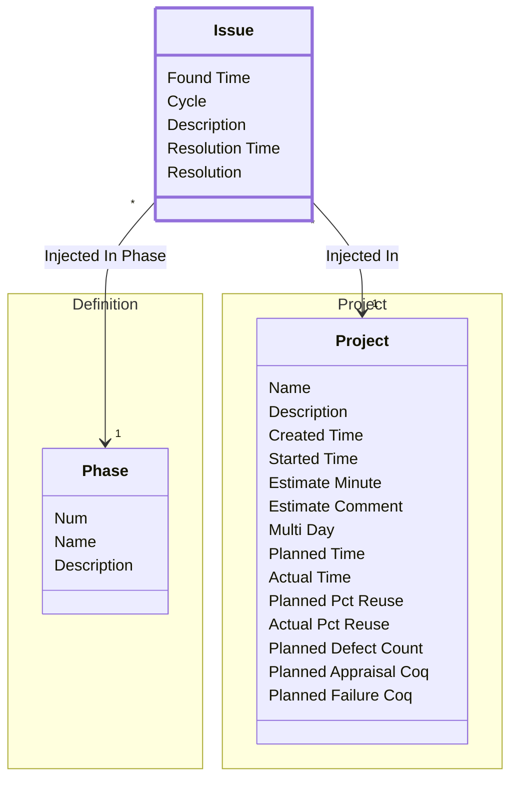

[⇦ Development Process](model.md) / [Process](domain-domain.process.md) / [Quality](subdomain-domain.process.subdomain.quality.md)

# Issue

An issue found in a project phase, with an optional resolution.

## Attributes

| Name | Rules | Nullable | TLA+ | Comments / Invariants |
| ---- | ----- | -------- | ---- | --------------------- |
| Found Time | _(unparsed)_ datetime | false |  |  |
| Cycle | _(unparsed)_ [0 .. unconstrained] at 1 unit | false |  |  |
| Description | _(unparsed)_ unconstrained | false |  |  |
| Resolution Time | _(unparsed)_ datetime | false |  |  |
| Resolution | _(unparsed)_ unconstrained | false |  |  |

## Relations

The classes in this diagram.

- **[Issue](class-domain.process.subdomain.quality.class.issue.md).** An issue found in a project phase, with an optional resolution.
- **[Definition::Phase](class-domain.process.subdomain.definition.class.phase.md).** Fundamental phase skeleton for a process family.
- **[Project::Project](class-domain.process.subdomain.project.class.project.md).** Work that follows a process.

# State Machine

## State and Event Descriptions

The states for this class.

*None*

The events for this class.

*None*

## Action Specifications

The actions for this class.

*None*

## Query Specifications

The queries for this class.

*None*
