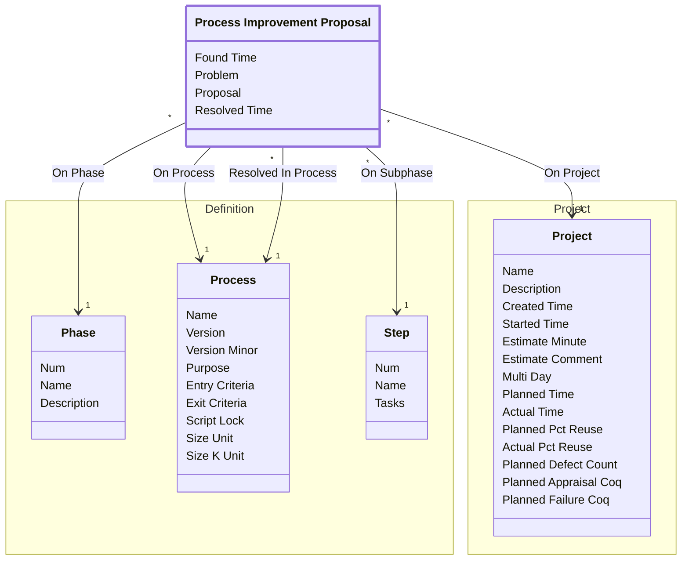

[⇦ Development Process](model.md) / [Process](domain-domain.process.md) / [Quality](subdomain-domain.process.subdomain.quality.md)

# Process Improvement Proposal

A process improvement proposal raised on a project.

## Attributes

| Name | Rules | Nullable | TLA+ | Comments / Invariants |
| ---- | ----- | -------- | ---- | --------------------- |
| Found Time | _(unparsed)_ datetime | false |  |  |
| Problem | _(unparsed)_ unconstrained | false |  |  |
| Proposal | _(unparsed)_ unconstrained | false |  |  |
| Resolved Time | _(unparsed)_ datetime | false |  |  |

## Relations

The classes in this diagram.

- **[Definition::Phase](class-domain.process.subdomain.definition.class.phase.md).** Fundamental phase skeleton for a process family.
- **[Definition::Process](class-domain.process.subdomain.definition.class.process.md).** A versioned process to follow, owned by a family.
- **[Process Improvement Proposal](class-domain.process.subdomain.quality.class.pip.md).** A process improvement proposal raised on a project.
- **[Project::Project](class-domain.process.subdomain.project.class.project.md).** Work that follows a process.
- **[Definition::Step](class-domain.process.subdomain.definition.class.step.md).** A step of a process script.

# State Machine

## State and Event Descriptions

The states for this class.

*None*

The events for this class.

*None*

## Action Specifications

The actions for this class.

*None*

## Query Specifications

The queries for this class.

*None*
