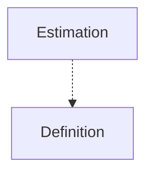

[⇦ Development Process](model.md)

# Process

Process families, scripts, and the estimates recorded against them.

## Subdomains

The subdomains of this domain.

- **[Definition](subdomain-domain.process.subdomain.definition.md).** The catalog of process families: phases, defect types, languages, processes, scripts, and steps.
- **[Estimation](subdomain-domain.process.subdomain.estimation.md).** Size and time estimates, including prior versions of each estimate.

