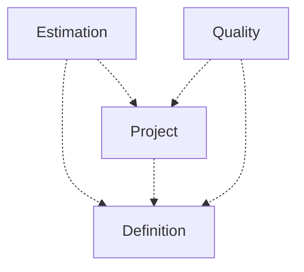

[⇦ Development Process](model.md)

# Process

Process families, projects that follow them, estimates, and quality records.

## Subdomains

The subdomains of this domain.

- **[Definition](subdomain-domain.process.subdomain.definition.md).** The catalog of process families: phases, defect types, languages, methods, templates, processes, scripts, and steps.
- **[Estimation](subdomain-domain.process.subdomain.estimation.md).** Size and time estimates, PROBE calculations, and lines-of-code accounts.
- **[Project](subdomain-domain.process.subdomain.project.md).** A project following a process: parts, cycles, schedule, tasks, and time logs.
- **[Quality](subdomain-domain.process.subdomain.quality.md).** Defects, issues, process improvement proposals, and test cases recorded against projects.

