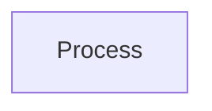

# Development Process

A process-definition, project, estimation, and quality catalog used to test the requirements tool.

Surrogate primary keys are object identity. Foreign keys are associations. Remaining columns are attributes. Commented SQL drafts are included: duplicate CREATE bodies for the same table are unioned; CREATE TABLE names that do not match DROP TABLE follow the DROP name.

## Live tables

| Table | Column | Model |
| --- | --- | --- |
| family | family_id | Family identity |
| family | name | Family.name (unique index) |
| family | description | Family.description |
| phase | phase_id | Phase identity |
| phase | family_id | Family Has Phases |
| phase | num | Phase.num (unique per family) |
| phase | name | Phase.name (unique per family) |
| phase | description | Phase.description |
| defect_type | defect_type_id | Defect Type identity |
| defect_type | family_id | Family Has Defect Types |
| defect_type | num | Defect Type.num (unique per family) |
| defect_type | name | Defect Type.name (unique per family) |
| defect_type | description | Defect Type.description |
| defect_type | base_num | Defect Type.base_num |
| language | language_id | Language identity |
| language | family_id | Family Has Languages |
| language | name | Language.name (unique per family) |
| language | description | Language.description |
| language | INDEX (language_id, family_id) | Supports Language composite FK; not a second identity |
| process | process_id | Process identity |
| process | family_id | Family Has Processes |
| process | name, version, version_minor | unique per family |
| process | purpose | Process.purpose |
| process | entry_criteria | Process.entry_criteria |
| process | exit_criteria | Process.exit_criteria |
| process | script_lock | Process.script_lock |
| process | ancestor_id | Process Has Ancestor |
| script | script_id | Script identity |
| script | process_id | Process Has Scripts |
| script | num | Script.num (unique per process) |
| script | name | Script.name (unique per process) |
| script | task_summary | Script.task_summary |
| script | purpose | Script.purpose |
| script | entry_criteria | Script.entry_criteria |
| script | exit_criteria | Script.exit_criteria |
| script | cycle | Script.cycle |
| step | step_id | Step identity |
| step | script_id | Script Has Steps |
| step | num | Step.num (unique per script) |
| step | name | Step.name (unique per script) |
| step | phase_id | Step Occurs In Phase |
| step | tasks | Step.tasks |
| estimate | estimate_id | Estimate identity |
| estimate | family_id | Family Has Estimates |
| estimate | language_id | Estimate Uses Language |
| estimate | axis | Estimate.axis |
| estimate | scope | Estimate.scope |
| estimate | version | Estimate.version |
| estimate | mean | Estimate.mean |
| estimate | variance | Estimate.variance |
| estimate | low | Estimate.low |
| estimate | high | Estimate.high |
| estimate | actual | Estimate.actual |
| estimate | method | Estimate.method |
| estimate | prediction_interval | Estimate.prediction_interval |
| estimate | comment | Estimate.comment |
| estimate | estimation_time | Estimate.estimation_time |
| estimate | guess_lowest_80pred | Estimate.guess_lowest_80pred |
| estimate | guess_highest_80pred | Estimate.guess_highest_80pred |
| estimate | sum_count | Estimate.sum_count |
| estimate | sum_mean | Estimate.sum_mean |
| estimate | sum_variance | Estimate.sum_variance |
| estimate | portion_portion | Estimate.portion_portion |
| estimate | portion_mean | Estimate.portion_mean |
| estimate | portion_variance | Estimate.portion_variance |
| estimate | INDEX (actual) | Lookup aid, not an identity |
| estimate_historic | estimate_id | Estimate Has History |
| estimate_historic | family_id | Estimate Historic Belongs To Family |
| estimate_historic | language_id | Estimate Historic Uses Language |
| estimate_historic | version | Estimate Historic.version (unique per estimate) |
| estimate_historic | remaining columns | Same attributes as Estimate |

## Commented tables

| Table | Column | Model |
| --- | --- | --- |
| method | method_id | Method identity |
| method | name | Method.name (unique index) |
| method | description | Method.description |
| project (both drafts) | project_id | Project identity |
| project | created_time | Project.created_time |
| project | name | Project.name |
| project | description | Project.description |
| project | process_id | Project Follows Process |
| project | started_time | Project.started_time |
| project | estimate_minute | Project.estimate_minute |
| project | estimate_comment | Project.estimate_comment |
| project | module_template_id | Project Instantiates |
| project | project_bucket_id | Project In Bucket |
| project | current_phase_id | Project Current Phase |
| project | current_subphase_id | Project Current Subphase |
| project | design_method_id | Project Uses Design Method |
| project | size_estimation_method_id | Project Uses Size Estimation Method |
| project | time_estimation_method_id | Project Uses Time Estimation Method |
| project | language_id | Project Uses Language |
| project | mutli_day | Project.multi_day |
| project | planned_time | Project.planned_time |
| project | actual_time | Project.actual_time |
| project | planned_pct_reuse | Project.planned_pct_reuse |
| project | actual_pct_reuse | Project.actual_pct_reuse |
| project | planned_defect_count | Project.planned_defect_count |
| project | planned_appraisal_coq | Project.planned_appraisal_coq |
| project | planned_failure_coq | Project.planned_failure_coq |
| project_stat_phase | project_stat_phase_id | Project Stat Phase identity |
| project_stat_phase | project_id | Project Has Stat Phases |
| project_stat_phase | stat_phase_id | Project Stat Phase For Phase |
| project_stat_phase | bucket_id | Project Stat Phase In Bucket |
| project_stat_phase | method_id | Project Stat Phase Uses Method |
| project_stat_phase | estimate_minute | Project Stat Phase.estimate_minute |
| project_stat_phase | estimate_comment | Project Stat Phase.estimate_comment |
| phase_products_check | phase_id, project_id | Project Checks Phase Products (association class) |
| phase_products_check | satisfied | Phase Products Check.satisfied |
| language (commented) | (duplicate of live language) | Language |
| design_method | design_id | Design Method identity |
| design_method | name | Design Method.name |
| design_method | description | Design Method.description |
| stats_bucket | stats_bucket_id | Stats Bucket identity |
| stats_bucket | name | Stats Bucket.name |
| stats_bucket | description | Stats Bucket.description |
| process (commented columns) | size_unit | Process.size_unit |
| process (commented columns) | size_k_unit | Process.size_k_unit |
| module_template | module_template_id | Module Template identity |
| module_template | process_id | Module Template Follows Process |
| module_template | name | Module Template.name |
| module_template | description | Module Template.description |
| module_template | size_estimation_method_id | Module Template Uses Size Estimation Method |
| module_template | time_estimation_method_id | Module Template Uses Time Estimation Method |
| module_template | design_method_id | Module Template Uses Design Method |
| module_template | language_id | Module Template Uses Language |
| project_part | (identity) | Project Part identity |
| project_part | module_template_id | Project Part Instantiates |
| project_part | project_bucket_id | Project Part In Bucket |
| project_part | name | Project Part.name |
| project_part | description | Project Part.description |
| project_part | current_phase_id | Project Part Current Phase |
| project_part | current_subphase_id | Project Part Current Subphase |
| project_part | design_method_id | Project Part Uses Design Method |
| project_part | size_estimation_method_id | Project Part Uses Size Estimation Method |
| project_part | time_estimation_method_id | Project Part Uses Time Estimation Method |
| project_part | language_id | Project Part Uses Language |
| project_part | mutli_day | Project Part.multi_day |
| project_part | planned_time | Project Part.planned_time |
| project_part | actual_time | Project Part.actual_time |
| project_part | planned_pct_reuse | Project Part.planned_pct_reuse |
| project_part | actual_pct_reuse | Project Part.actual_pct_reuse |
| project_part | planned_defect_count | Project Part.planned_defect_count |
| project_part | planned_appraisal_coq | Project Part.planned_appraisal_coq |
| project_part | planned_failure_coq | Project Part.planned_failure_coq |
| project_part | (implicit project) | Project Has Parts |
| project_cycle_plan | (identity) | Project Cycle Plan identity |
| project_cycle_plan | module_template_id | Project Cycle Plan Instantiates |
| project_cycle_plan | num | Project Cycle Plan.num |
| project_cycle_plan | planned_pct_reuse | Project Cycle Plan.planned_pct_reuse |
| project_cycle_plan | (project) | Project Has Cycle Plans |
| project_cycle_actual | (identity) | Project Cycle Actual identity |
| project_cycle_actual | module_template_id | Project Cycle Actual Instantiates |
| project_cycle_actual | num | Project Cycle Actual.num |
| project_cycle_actual | actual_pct_reuse | Project Cycle Actual.actual_pct_reuse |
| project_cycle_actual | (project) | Project Has Cycle Actuals |
| estimate_loc | estimate_id | Estimate Loc identity |
| estimate_loc | project_id | Project Has Loc Estimate |
| estimate_loc | base, new, changed, added, modified, deleted, reused, object_loc | Estimate Loc attributes |
| estimate_loc | phase_id (FK only) | Estimate Loc For Phase |
| probe_object_type | (catalog) | Probe Object Type; CREATE body duplicated estimate_probe columns already on Estimate Probe |
| probe_object_type | number, name, description | Probe Object Type attributes |
| estimate_probe | estimate_id | Estimate Probe identity (association class of Project Has Probe Estimate For Phase) |
| estimate_probe | project_id, phase_id | Project Has Probe Estimate For |
| estimate_probe | remaining loc/regression columns | Estimate Probe attributes |
| probe_type | probe_type_id | Probe Type identity |
| probe_type | number, name, description | Probe Type attributes |
| probe_object_size | (identity) | Probe Object Size identity |
| probe_object_size | number, name, description | Probe Object Size attributes |
| estimate_probe_add_loc | estimate_probe_add_loc_id | Estimate Probe Add Loc identity |
| estimate_probe_add_loc | project_id | Project Has Probe Add Loc |
| estimate_probe_add_loc | name | Estimate Probe Add Loc.name |
| estimate_probe_add_loc | type | Estimate Probe Add Loc Of Type |
| estimate_probe_add_loc | relative_size | Estimate Probe Add Loc Of Size |
| estimate_probe_add_loc | loc | Estimate Probe Add Loc.loc |
| estimate_probe_add_loc | acual_loc | Estimate Probe Add Loc.actual_loc |
| estimate_probe_add_loc | phase_id (FK only) | Estimate Probe Add Loc For Phase |
| estimate_probe_object_loc | (identity) | Estimate Probe Object Loc identity |
| estimate_probe_object_loc | project_id | Project Has Probe Object Loc |
| estimate_probe_object_loc | name | Estimate Probe Object Loc.name |
| estimate_probe_object_loc | type | Estimate Probe Object Loc Of Type |
| estimate_probe_object_loc | relative_size | Estimate Probe Object Loc Of Size |
| estimate_probe_object_loc | loc_per_method | Estimate Probe Object Loc.loc_per_method |
| estimate_probe_object_loc | acual_loc | Estimate Probe Object Loc.actual_loc |
| estimate_probe_object_loc | for_reuse | Estimate Probe Object Loc.for_reuse |
| estimate_probe_object_loc | phase_id (FK only) | Estimate Probe Object Loc For Phase |
| estimate_probe_object_reused | (identity) | Estimate Probe Object Reused identity |
| estimate_probe_object_reused | project_id | Project Has Probe Object Reused |
| estimate_probe_object_reused | name | Estimate Probe Object Reused.name |
| estimate_probe_object_reused | loc | Estimate Probe Object Reused.loc |
| estimate_probe_object_reused | acual_loc | Estimate Probe Object Reused.actual_loc |
| estimate_probe_object_reused | phase_id (FK only) | Estimate Probe Object Reused For Phase |
| actual_loc | estimate_id | Actual Loc identity |
| actual_loc | project_id | Project Has Actual Loc |
| actual_loc | cycle | Actual Loc.cycle |
| actual_loc | base, new, changed, added, modified, deleted, reused, object_loc | Actual Loc attributes |
| actual_loc | phase_id (FK only) | Actual Loc For Phase |
| schedule | schedule_id | Schedule identity |
| schedule | project_id | Project Has Schedule |
| schedule | day_or_week | Schedule.day_or_week |
| schedule_week | schedule_week_id | Schedule Week identity |
| schedule_week | schedule_id | Schedule Has Weeks |
| schedule_week | project_id | Schedule Week For Project |
| schedule_week | num | Schedule Week.num |
| schedule_week | date_monday | Schedule Week.date_monday |
| task | task_id | Task identity |
| task | project_id | Project Has Tasks |
| task | phase_id | Task Occurs In |
| task | schedule_week_id | Task On Week |
| task | num | Task.num |
| task | name | Task.name |
| task | planned_hours | Task.planned_hours |
| task | pct_complete | Task.pct_complete |
| time_log | time_log_id | Time Log identity |
| time_log | project_id | Project Has Time Logs |
| time_log | phase_id | Time Log Occurs In |
| time_log | cycle | Time Log.cycle |
| time_log | task_id | Time Log For Task |
| time_log | start_time | Time Log.start_time |
| time_log | stop_time | Time Log.stop_time |
| time_log | interruption_minutes | Time Log.interruption_minutes |
| time_log | comments | Time Log.comments |
| defect_type (commented) | (duplicate of live defect_type) | Defect Type |
| defect | defect_id | Defect identity |
| defect | found_time | Defect.found_time |
| defect | inject_project_id | Defect Injected In |
| defect | cycle | Defect.cycle |
| defect | inject_phase_id | Defect Injected In Phase |
| defect | remove_project_id | Defect Removed In |
| defect | remove_phase_id | Defect Removed In Phase |
| defect | fix_minutes | Defect.fix_minutes |
| defect | source_defect_id | Defect Has Source |
| defect | description | Defect.description |
| issue | issue_id | Issue identity |
| issue | found_time | Issue.found_time |
| issue | inject_project_id | Issue Injected In |
| issue | cycle | Issue.cycle |
| issue | inject_phase_id | Issue Injected In Phase |
| issue | description | Issue.description |
| issue | resolution_time | Issue.resolution_time |
| issue | resolution | Issue.resolution |
| pip | pip_id | Pip identity |
| pip | found_time | Pip.found_time |
| pip | project_id | Pip On Project |
| pip | process_id | Pip On Process |
| pip | phase_id | Pip On Phase |
| pip | subphase_id | Pip On Subphase |
| pip | problem | Pip.problem |
| pip | proposal | Pip.proposal |
| pip | resolved_time | Pip.resolved_time |
| pip | resolved_in_process_id | Pip Resolved In Process |
| test_case | test_case_id | Test Case identity |
| test_case | found_time | Test Case.found_time |
| test_case | project_id | Test Case For Project |
| test_case | objective | Test Case.objective |
| test_case | description | Test Case.description |
| test_case | conditions | Test Case.conditions |
| test_case | expected | Test Case.expected |
| test_case_result | (identity) | Test Case Result identity |
| test_case_result | test_case_id | Test Case Has Results |
| test_case_result | run_time | Test Case Result.run_time |
| test_case_result | project_id | Test Case Result For Project |
| test_case_result | actual | Test Case Result.actual |
## Actors

The actors of this model.

## Domains

The domains of this model.

- **[Process](domain-domain.process.md).** Process families, projects that follow them, estimates, and quality records.

## Invariants

## Global Functions

*No global functions*

## Named Sets

*No named sets*
