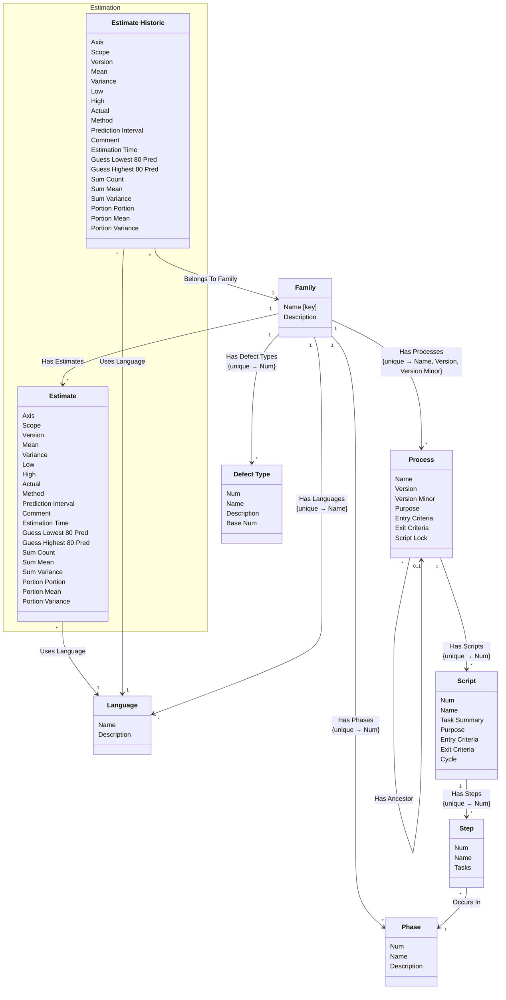

[⇦ Development Process](model.md) / [Process](domain-domain.process.md)

# Definition

The catalog of process families: phases, defect types, languages, processes, scripts, and steps.
## Classes

The classes of this subdomain.

- **[Defect Type](class-domain.process.subdomain.definition.class.defect_type.md).** A type of defect classified within a process family.
- **[Family](class-domain.process.subdomain.definition.class.family.md).** Core partitioning of the catalog.
- **[Language](class-domain.process.subdomain.definition.class.language.md).** A programming language used when estimating size or time in a process family.
- **[Phase](class-domain.process.subdomain.definition.class.phase.md).** Fundamental phase skeleton for a process family.
- **[Process](class-domain.process.subdomain.definition.class.process.md).** A versioned process to follow, owned by a family.
- **[Script](class-domain.process.subdomain.definition.class.script.md).** A step-by-step process script owned by a process.
- **[Step](class-domain.process.subdomain.definition.class.step.md).** A step of a process script.
- **[Estimation::Estimate](class-domain.process.subdomain.estimation.class.estimate.md).** An estimate of size or time, categorized by family, language, axis, and scope.
- **[Estimation::Estimate Historic](class-domain.process.subdomain.estimation.class.estimate_historic.md).** A stored prior iteration of an estimate.

[Model facts](subdomain-domain.process.subdomain.definition-facts.md)

## Use Cases

