[⇦ Development Process](model.md) / [Process](domain-domain.process.md)

# Estimation

Size and time estimates, PROBE calculations, and lines-of-code accounts.
## Classes

The classes of this subdomain.

```mermaid
---
config:
  class:
    hideEmptyMembersBox: true
---
classDiagram
class class_domain_process_subdomain_estimation_class_actual_loc["Actual Loc"] {
        Cycle
        Base
        New
        Changed
        Added
        Modified
        Deleted
        Reused
        Object Loc
    }
class class_domain_process_subdomain_estimation_class_estimate["Estimate"] {
        Axis
        Scope
        Version
        Mean
        Variance
        Low
        High
        Actual
        Method
        Prediction Interval
        Comment
        Estimation Time
        Guess Lowest 80 Pred
        Guess Highest 80 Pred
        Sum Count
        Sum Mean
        Sum Variance
        Portion Portion
        Portion Mean
        Portion Variance
    }
class class_domain_process_subdomain_estimation_class_estimate_historic["Estimate Historic"] {
        Axis
        Scope
        Version
        Mean
        Variance
        Low
        High
        Actual
        Method
        Prediction Interval
        Comment
        Estimation Time
        Guess Lowest 80 Pred
        Guess Highest 80 Pred
        Sum Count
        Sum Mean
        Sum Variance
        Portion Portion
        Portion Mean
        Portion Variance
    }
class class_domain_process_subdomain_estimation_class_estimate_loc["Estimate Loc"] {
        Base
        New
        Changed
        Added
        Modified
        Deleted
        Reused
        Object Loc
    }
class class_domain_process_subdomain_estimation_class_estimate_probe["Estimate Probe"] {
        Base Loc
        Deleted Loc
        Modified Loc
        B0 Size
        B1 Size
        B0 Time
        B1 Time
        New Loc
        New Reuse Loc
        Estimated Time Min
        Upper Prediction Interval
        Lower Prediction Interval
        Prediction Interval Percent
        Actual Base Loc
        Actual Deleted Loc
        Actual Modified Loc
        Loc Upper Prediction Interval 70
        Loc Lower Prediction Interval 70
        Time Upper Prediction Interval 70
        Time Lower Prediction Interval 70
    }
class class_domain_process_subdomain_estimation_class_estimate_probe_add_loc["Estimate Probe Add Loc"] {
        Name
        Loc
        Actual Loc
    }
class class_domain_process_subdomain_estimation_class_estimate_probe_object_loc["Estimate Probe Object Loc"] {
        Name
        Loc Per Method
        Actual Loc
        For Reuse
    }
class class_domain_process_subdomain_estimation_class_estimate_probe_object_reused["Estimate Probe Object Reused"] {
        Name
        Loc
        Actual Loc
    }
namespace Definition {
class class_domain_process_subdomain_definition_class_family["Family"] {
            Name [key]
            Description
        }
class class_domain_process_subdomain_definition_class_language["Language"] {
            Name
            Description
        }
class class_domain_process_subdomain_definition_class_phase["Phase"] {
            Num
            Name
            Description
        }
class class_domain_process_subdomain_definition_class_probe_object_size["Probe Object Size"] {
            Number
            Name
            Description
        }
class class_domain_process_subdomain_definition_class_probe_type["Probe Type"] {
            Number
            Name
            Description
        }
}
namespace Project {
class class_domain_process_subdomain_project_class_project["Project"] {
            Name
            Description
            Created Time
            Started Time
            Estimate Minute
            Estimate Comment
            Multi Day
            Planned Time
            Actual Time
            Planned Pct Reuse
            Actual Pct Reuse
            Planned Defect Count
            Planned Appraisal Coq
            Planned Failure Coq
        }
}
class assoc_domain_process_cassociation_subdomain_project_class_project_subdomain_definition_class_phase_has_probe_estimate_for["Has Probe Estimate For"]
<<association>> assoc_domain_process_cassociation_subdomain_project_class_project_subdomain_definition_class_phase_has_probe_estimate_for
style assoc_domain_process_cassociation_subdomain_project_class_project_subdomain_definition_class_phase_has_probe_estimate_for stroke:#333,stroke-dasharray:5 5
class_domain_process_subdomain_definition_class_family "1" --> "*" class_domain_process_subdomain_estimation_class_estimate : Has Estimates
class_domain_process_subdomain_estimation_class_actual_loc "*" --> "1" class_domain_process_subdomain_definition_class_phase : For Phase
class_domain_process_subdomain_estimation_class_estimate "*" --> "1" class_domain_process_subdomain_definition_class_language : Uses Language
class_domain_process_subdomain_estimation_class_estimate_historic "*" --> "1" class_domain_process_subdomain_definition_class_family : Belongs To Family
class_domain_process_subdomain_estimation_class_estimate_historic "*" --> "1" class_domain_process_subdomain_definition_class_language : Uses Language
class_domain_process_subdomain_estimation_class_estimate_loc "*" --> "1" class_domain_process_subdomain_definition_class_phase : For Phase
class_domain_process_subdomain_estimation_class_estimate_probe_add_loc "*" --> "1" class_domain_process_subdomain_definition_class_phase : For Phase
class_domain_process_subdomain_estimation_class_estimate_probe_add_loc "*" --> "1" class_domain_process_subdomain_definition_class_probe_object_size : Of Size
class_domain_process_subdomain_estimation_class_estimate_probe_add_loc "*" --> "1" class_domain_process_subdomain_definition_class_probe_type : Of Type
class_domain_process_subdomain_estimation_class_estimate_probe_object_loc "*" --> "1" class_domain_process_subdomain_definition_class_phase : For Phase
class_domain_process_subdomain_estimation_class_estimate_probe_object_loc "*" --> "1" class_domain_process_subdomain_definition_class_probe_object_size : Of Size
class_domain_process_subdomain_estimation_class_estimate_probe_object_loc "*" --> "1" class_domain_process_subdomain_definition_class_probe_type : Of Type
class_domain_process_subdomain_estimation_class_estimate_probe_object_reused "*" --> "1" class_domain_process_subdomain_definition_class_phase : For Phase
class_domain_process_subdomain_project_class_project "1" -- assoc_domain_process_cassociation_subdomain_project_class_project_subdomain_definition_class_phase_has_probe_estimate_for
    assoc_domain_process_cassociation_subdomain_project_class_project_subdomain_definition_class_phase_has_probe_estimate_for --> "*" class_domain_process_subdomain_definition_class_phase
    class_domain_process_subdomain_estimation_class_estimate_probe .. assoc_domain_process_cassociation_subdomain_project_class_project_subdomain_definition_class_phase_has_probe_estimate_for
class_domain_process_subdomain_project_class_project "1" --> "0..1" class_domain_process_subdomain_estimation_class_actual_loc : Has Actual Loc
class_domain_process_subdomain_project_class_project "1" --> "0..1" class_domain_process_subdomain_estimation_class_estimate_loc : Has Loc Estimate
class_domain_process_subdomain_project_class_project "1" --> "*" class_domain_process_subdomain_estimation_class_estimate_probe_add_loc : Has Probe Add Loc
class_domain_process_subdomain_project_class_project "1" --> "*" class_domain_process_subdomain_estimation_class_estimate_probe_object_loc : Has Probe Object Loc
class_domain_process_subdomain_project_class_project "1" --> "*" class_domain_process_subdomain_estimation_class_estimate_probe_object_reused : Has Probe Object Reused
class_domain_process_subdomain_estimation_class_estimate "1" --> "*" class_domain_process_subdomain_estimation_class_estimate_historic : Has History<br/>{unique → Version}

```

- **[Actual Loc](class-domain.process.subdomain.estimation.class.actual_loc.md).** Actual lines-of-code account for a project.
- **[Estimate](class-domain.process.subdomain.estimation.class.estimate.md).** An estimate of size or time, categorized by family, language, axis, and scope.
- **[Estimate Historic](class-domain.process.subdomain.estimation.class.estimate_historic.md).** A stored prior iteration of an estimate.
- **[Estimate Loc](class-domain.process.subdomain.estimation.class.estimate_loc.md).** Planned lines-of-code account for a project.
- **[Estimate Probe](class-domain.process.subdomain.estimation.class.estimate_probe.md).** PROBE size and time calculation for a project in a phase.
- **[Estimate Probe Add Loc](class-domain.process.subdomain.estimation.class.estimate_probe_add_loc.md).** An added-object line in a PROBE size estimate.
- **[Estimate Probe Object Loc](class-domain.process.subdomain.estimation.class.estimate_probe_object_loc.md).** A new-object line in a PROBE size estimate.
- **[Estimate Probe Object Reused](class-domain.process.subdomain.estimation.class.estimate_probe_object_reused.md).** A reused-object line in a PROBE size estimate.
- **[Definition::Family](class-domain.process.subdomain.definition.class.family.md).** Core partitioning of the catalog.
- **[Definition::Language](class-domain.process.subdomain.definition.class.language.md).** A programming language used when estimating size or time in a process family.
- **[Definition::Phase](class-domain.process.subdomain.definition.class.phase.md).** Fundamental phase skeleton for a process family.
- **[Definition::Probe Object Size](class-domain.process.subdomain.definition.class.probe_object_size.md).** A relative size category used when estimating objects with PROBE.
- **[Definition::Probe Type](class-domain.process.subdomain.definition.class.probe_type.md).** A PROBE object-type category used when listing added and new objects.
- **[Project::Project](class-domain.process.subdomain.project.class.project.md).** Work that follows a process.

[Model facts](subdomain-domain.process.subdomain.estimation-facts.md)

## Use Cases

