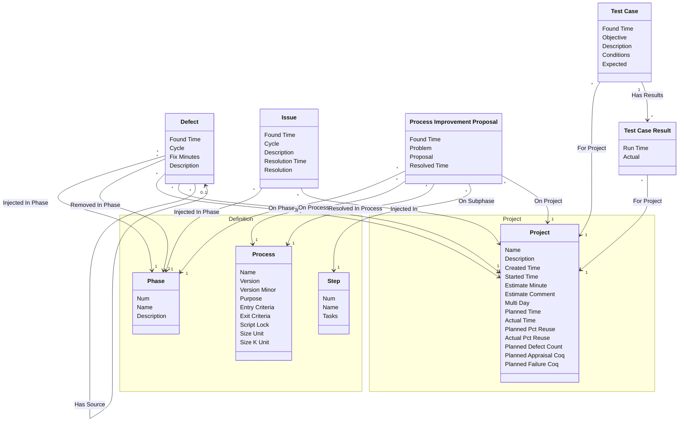

[⇦ Development Process](model.md) / [Process](domain-domain.process.md)

# Quality

Defects, issues, process improvement proposals, and test cases recorded against projects.
## Classes

The classes of this subdomain.

- **[Defect](class-domain.process.subdomain.quality.class.defect.md).** A defect injected and removed in projects and phases.
- **[Issue](class-domain.process.subdomain.quality.class.issue.md).** An issue found in a project phase, with an optional resolution.
- **[Process Improvement Proposal](class-domain.process.subdomain.quality.class.pip.md).** A process improvement proposal raised on a project.
- **[Test Case](class-domain.process.subdomain.quality.class.test_case.md).** A test case defined for a project.
- **[Test Case Result](class-domain.process.subdomain.quality.class.test_case_result.md).** A recorded run of a test case.
- **[Definition::Phase](class-domain.process.subdomain.definition.class.phase.md).** Fundamental phase skeleton for a process family.
- **[Definition::Process](class-domain.process.subdomain.definition.class.process.md).** A versioned process to follow, owned by a family.
- **[Project::Project](class-domain.process.subdomain.project.class.project.md).** Work that follows a process.
- **[Definition::Step](class-domain.process.subdomain.definition.class.step.md).** A step of a process script.

[Model facts](subdomain-domain.process.subdomain.quality-facts.md)

## Use Cases

