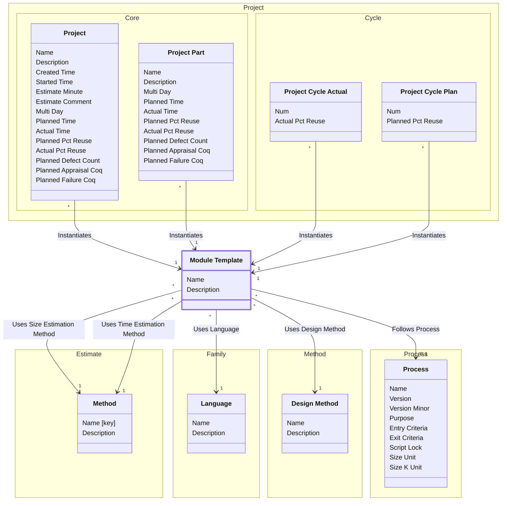

[⇦ Development](model.md) / [Process](domain-domain.process.md) / [Definition](subdomain-domain.process.subdomain.definition.md)

# Module Template

Shared configuration for projects (and project parts) that follow a process.

## Attributes

| Name | Rules | Nullable | TLA+ | Comments / Invariants |
| ---- | ----- | -------- | ---- | --------------------- |
| Name | _(unparsed)_ unconstrained | false |  |  |
| Description | _(unparsed)_ unconstrained | true |  |  |

## Relations

The classes in this diagram.

- **[Method::Design Method](class-domain.process.subdomain.method.class.design_method.md).** A design template used when planning a project or module.
- **[Family::Language](class-domain.process.subdomain.family.class.language.md).** A programming language used when estimating size or time in a process family.
- **[Estimate::Method](class-domain.process.subdomain.estimate.class.method.md).** A programming method used when recording phase statistics for a project.
- **[Module Template](class-domain.process.subdomain.definition.class.module_template.md).** Shared configuration for projects (and project parts) that follow a process.
- **[Process::Process](class-domain.process.subdomain.process.class.process.md).** A versioned process to follow, owned by a family.
- **[Project::Core::Project](class-domain.project.subdomain.core.class.project.md).** Work that follows a process.
- **[Project::Cycle::Project Cycle Actual](class-domain.project.subdomain.cycle.class.project_cycle_actual.md).** Actual recording values for one cycle of a project.
- **[Project::Cycle::Project Cycle Plan](class-domain.project.subdomain.cycle.class.project_cycle_plan.md).** Planned recording values for one cycle of a project.
- **[Project::Core::Project Part](class-domain.project.subdomain.core.class.project_part.md).** A language-specific part of a project.

# State Machine

## State and Event Descriptions

The states for this class.

*None*

The events for this class.

*None*

## Action Specifications

The actions for this class.

*None*

## Query Specifications

The queries for this class.

*None*
