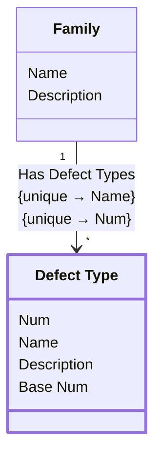

[⇦ Development](model.md) / [Process](domain-domain.process.md) / [Family](subdomain-domain.process.subdomain.family.md)

# Defect Type

A type of defect classified within a process family.

## Attributes

| Name | Rules | Nullable | TLA+ | Comments / Invariants |
| ---- | ----- | -------- | ---- | --------------------- |
| Num | _(unparsed)_ [0 .. unconstrained] at 1 unit | false |  | Order of this defect type within the family. |
| Name | _(unparsed)_ unconstrained | false |  | Unique among defect types of the same family. |
| Description | _(unparsed)_ unconstrained | true |  |  |
| Base Num | _(unparsed)_ [0 .. unconstrained] at 1 unit | false |  | Base classification number for this defect type. |

## Relations

The classes in this diagram.

- **[Defect Type](class-domain.process.subdomain.family.class.defect_type.md).** A type of defect classified within a process family.
- **[Family](class-domain.process.subdomain.family.class.family.md).** A family is a shared group of processes, and by extention a shared group of projects that use those processes.

# State Machine

## State and Event Descriptions

The states for this class.

*None*

The events for this class.

*None*

## Action Specifications

The actions for this class.

*None*

## Query Specifications

The queries for this class.

*None*
