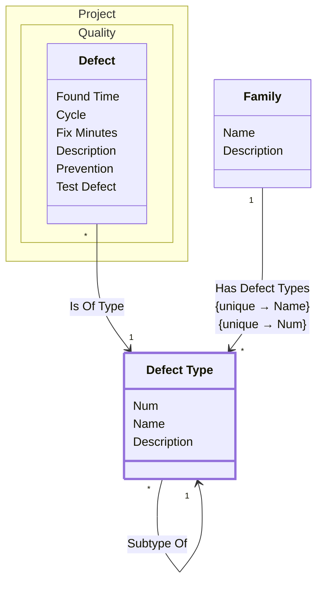

[⇦ Development](model.md) / [Process](domain-domain.process.md) / [Family](subdomain-domain.process.subdomain.family.md)

# Defect Type

A type of defect classified within a process family.

All processes in the same family use the same defect types, which allows analysis of defects across projects in the family.

## Attributes

| Name | Rules | Nullable | TLA+ | Comments / Invariants |
| ---- | ----- | -------- | ---- | --------------------- |
| Num | _(unparsed)_ [10 .. unconstrained] at 1 unit | false |  | The unique value for this defect type, every 10 value is a base type and the number to the next base are subtypes. |
| Name | _(unparsed)_ unconstrained | false |  | A simple name for this type of defect. |
| Description | _(unparsed)_ unconstrained | true |  | What kind of defects are this type. |

## Relations

The classes in this diagram.

```mermaid
---
config:
  class:
    hideEmptyMembersBox: true
---
classDiagram
class class_domain_process_subdomain_family_class_defect_type["Defect Type"] {
        Num
        Name
        Description
    }
class class_domain_process_subdomain_family_class_family["Family"] {
        Name
        Description
    }
namespace Project.Quality {
class class_domain_project_subdomain_quality_class_defect["Defect"] {
            Found Time
            Cycle
            Fix Minutes
            Description
            Prevention
            Test Defect
        }
}
style class_domain_process_subdomain_family_class_defect_type stroke:#9370DB,stroke-width:3px
class_domain_project_subdomain_quality_class_defect "*" --> "1" class_domain_process_subdomain_family_class_defect_type : Is Of Type
class_domain_process_subdomain_family_class_defect_type "*" --> "1" class_domain_process_subdomain_family_class_defect_type : Subtype Of
class_domain_process_subdomain_family_class_family "1" --> "*" class_domain_process_subdomain_family_class_defect_type : Has Defect Types<br/>{unique → Name}<br/>{unique → Num}

```
- **[Project::Quality::Defect](class-domain.project.subdomain.quality.class.defect.md).** A defect injected and removed in projects and phases.
- **[Defect Type](class-domain.process.subdomain.family.class.defect_type.md).** A type of defect classified within a process family.
- **[Family](class-domain.process.subdomain.family.class.family.md).** A family is a shared group of processes, and by extention a shared group of projects that use those processes.

# State Machine

## State and Event Descriptions

The states for this class.

*None*

The events for this class.

*None*

## Action Specifications

The actions for this class.

*None*

## Query Specifications

The queries for this class.

*None*
