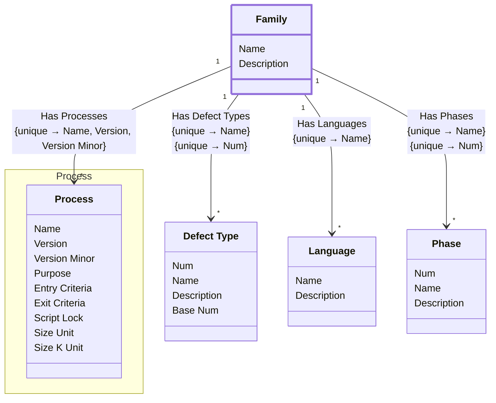

[⇦ Development](model.md) / [Process](domain-domain.process.md) / [Family](subdomain-domain.process.subdomain.family.md)

# Family

A family is a shared group of processes, and by extention a shared group of projects that use those processes.

The basic concept is that you may have a set of processes for writing software and a set of processes for writing a novel, and this is a way to bucket them easily.

## Attributes

| Name | Rules | Nullable | TLA+ | Comments / Invariants |
| ---- | ----- | -------- | ---- | --------------------- |
| Name | _(unparsed)_ unconstrained | false |  | The name of this family. |
| Description | _(unparsed)_ unconstrained | true |  | A description of this family of processes. |

## Relations

The classes in this diagram.

- **[Defect Type](class-domain.process.subdomain.family.class.defect_type.md).** A type of defect classified within a process family.
- **[Family](class-domain.process.subdomain.family.class.family.md).** A family is a shared group of processes, and by extention a shared group of projects that use those processes.
- **[Language](class-domain.process.subdomain.family.class.language.md).** A programming language used when estimating size or time in a process family.
- **[Phase](class-domain.process.subdomain.family.class.phase.md).** Fundamental phase skeleton for all the processes in a family.
- **[Process::Process](class-domain.process.subdomain.process.class.process.md).** A versioned process to follow, owned by a family.

# State Machine

## State and Event Descriptions

The states for this class.

*None*

The events for this class.

*None*

## Action Specifications

The actions for this class.

*None*

## Query Specifications

The queries for this class.

*None*
