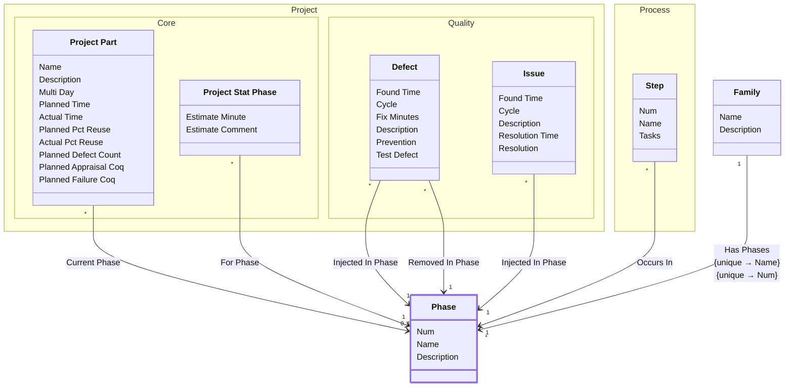

[⇦ Development](model.md) / [Process](domain-domain.process.md) / [Family](subdomain-domain.process.subdomain.family.md)

# Phase

Fundamental phase skeleton for all the processes in a family.

Not every process will use every phase, but all processes use phases that are shared across the family.

## Attributes

| Name | Rules | Nullable | TLA+ | Comments / Invariants |
| ---- | ----- | -------- | ---- | --------------------- |
| Num | _(unparsed)_ [1 .. unconstrained] at 1 unit | false |  | Order of this phase within the family, same order across all processes. |
| Name | _(unparsed)_ unconstrained | false |  | Unique among phases of the same family, same name across all processes. |
| Description | _(unparsed)_ unconstrained | true |  | A high level description of this phase. |

## Relations

The classes in this diagram.

- **[Project::Quality::Defect](class-domain.project.subdomain.quality.class.defect.md).** A defect injected and removed in projects and phases.
- **[Family](class-domain.process.subdomain.family.class.family.md).** A family is a shared group of processes, and by extention a shared group of projects that use those processes.
- **[Project::Quality::Issue](class-domain.project.subdomain.quality.class.issue.md).** An issue found in a project phase, with an optional resolution.
- **[Phase](class-domain.process.subdomain.family.class.phase.md).** Fundamental phase skeleton for all the processes in a family.
- **[Project::Core::Project Part](class-domain.project.subdomain.core.class.project_part.md).** A language-specific part of a project.
- **[Project::Core::Project Stat Phase](class-domain.project.subdomain.core.class.project_stat_phase.md).** A per-phase statistical estimate on a project. stat_phase is Phase; bucket is Stats Bucket.
- **[Process::Step](class-domain.process.subdomain.process.class.step.md).** A step of a process script.

# State Machine

## State and Event Descriptions

The states for this class.

*None*

The events for this class.

*None*

## Action Specifications

The actions for this class.

*None*

## Query Specifications

The queries for this class.

*None*
