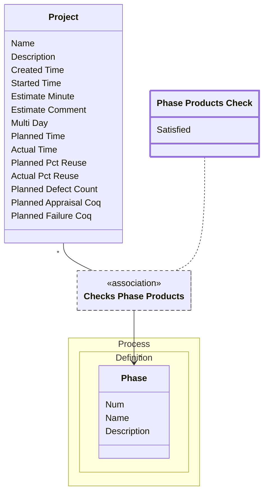

[⇦ Development Process](model.md) / [Project](domain-domain.project.md) / [Core](subdomain-domain.project.subdomain.core.md)

# Phase Products Check

Whether a project's products for a phase are satisfied.

## Attributes

| Name | Rules | Nullable | TLA+ | Comments / Invariants |
| ---- | ----- | -------- | ---- | --------------------- |
| Satisfied | _(unparsed)_ enum of TRUE, FALSE | false |  |  |

## Relations

The classes in this diagram.

- **[Process::Definition::Phase](class-domain.process.subdomain.definition.class.phase.md).** Fundamental phase skeleton for a process family.
- **[Phase Products Check](class-domain.project.subdomain.core.class.phase_products_check.md).** Whether a project's products for a phase are satisfied.
- **[Project](class-domain.project.subdomain.core.class.project.md).** Work that follows a process.

# State Machine

## State and Event Descriptions

The states for this class.

*None*

The events for this class.

*None*

## Action Specifications

The actions for this class.

*None*

## Query Specifications

The queries for this class.

*None*
