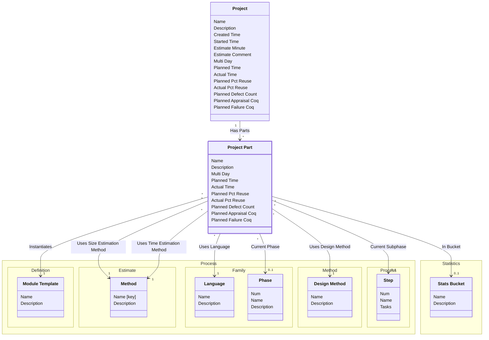

[⇦ Development](model.md) / [Project](domain-domain.project.md) / [Core](subdomain-domain.project.subdomain.core.md)

# Project Part

A language-specific part of a project.

## Attributes

| Name | Rules | Nullable | TLA+ | Comments / Invariants |
| ---- | ----- | -------- | ---- | --------------------- |
| Name | _(unparsed)_ unconstrained | false |  |  |
| Description | _(unparsed)_ unconstrained | true |  |  |
| Multi Day | _(unparsed)_ enum of TRUE, FALSE | false |  | SQL column mutli_day. |
| Planned Time | _(unparsed)_ [0 .. unconstrained] at 1 unit | false |  |  |
| Actual Time | _(unparsed)_ [0 .. unconstrained] at 1 unit | false |  |  |
| Planned Pct Reuse | _(unparsed)_ [0 .. 100] at 1 percent | false |  |  |
| Actual Pct Reuse | _(unparsed)_ [0 .. 100] at 1 percent | false |  |  |
| Planned Defect Count | _(unparsed)_ [0 .. unconstrained] at 1 unit | false |  |  |
| Planned Appraisal Coq | _(unparsed)_ [0 .. unconstrained] at 1 unit | false |  |  |
| Planned Failure Coq | _(unparsed)_ [0 .. unconstrained] at 1 unit | false |  |  |

## Relations

The classes in this diagram.

- **[Process::Method::Design Method](class-domain.process.subdomain.method.class.design_method.md).** A design template used when planning a project or module.
- **[Process::Family::Language](class-domain.process.subdomain.family.class.language.md).** A programming language used when estimating size or time in a process family.
- **[Process::Estimate::Method](class-domain.process.subdomain.estimate.class.method.md).** A programming method used when recording phase statistics for a project.
- **[Process::Definition::Module Template](class-domain.process.subdomain.definition.class.module_template.md).** Shared configuration for projects (and project parts) that follow a process.
- **[Process::Family::Phase](class-domain.process.subdomain.family.class.phase.md).** Fundamental phase skeleton for all the processes in a family.
- **[Project](class-domain.project.subdomain.core.class.project.md).** Work that follows a process.
- **[Project Part](class-domain.project.subdomain.core.class.project_part.md).** A language-specific part of a project.
- **[Statistics::Stats Bucket](class-domain.statistics.subdomain.default.class.stats_bucket.md).** A bucket used to group project statistics.
- **[Process::Process::Step](class-domain.process.subdomain.process.class.step.md).** A step of a process script.

# State Machine

## State and Event Descriptions

The states for this class.

*None*

The events for this class.

*None*

## Action Specifications

The actions for this class.

*None*

## Query Specifications

The queries for this class.

*None*
