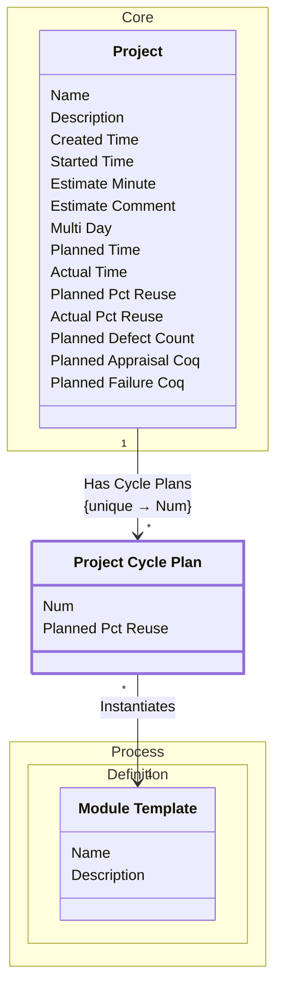

[⇦ Development](model.md) / [Project](domain-domain.project.md) / [Cycle](subdomain-domain.project.subdomain.cycle.md)

# Project Cycle Plan

Planned recording values for one cycle of a project.

## Attributes

| Name | Rules | Nullable | TLA+ | Comments / Invariants |
| ---- | ----- | -------- | ---- | --------------------- |
| Num | _(unparsed)_ [0 .. unconstrained] at 1 unit | true |  | Cycle number. Unique among cycle plans of the same project. |
| Planned Pct Reuse | _(unparsed)_ [0 .. 100] at 1 percent | false |  |  |

## Relations

The classes in this diagram.

- **[Process::Definition::Module Template](class-domain.process.subdomain.definition.class.module_template.md).** Shared configuration for projects (and project parts) that follow a process.
- **[Core::Project](class-domain.project.subdomain.core.class.project.md).** Work that follows a process.
- **[Project Cycle Plan](class-domain.project.subdomain.cycle.class.project_cycle_plan.md).** Planned recording values for one cycle of a project.

# State Machine

## State and Event Descriptions

The states for this class.

*None*

The events for this class.

*None*

## Action Specifications

The actions for this class.

*None*

## Query Specifications

The queries for this class.

*None*
