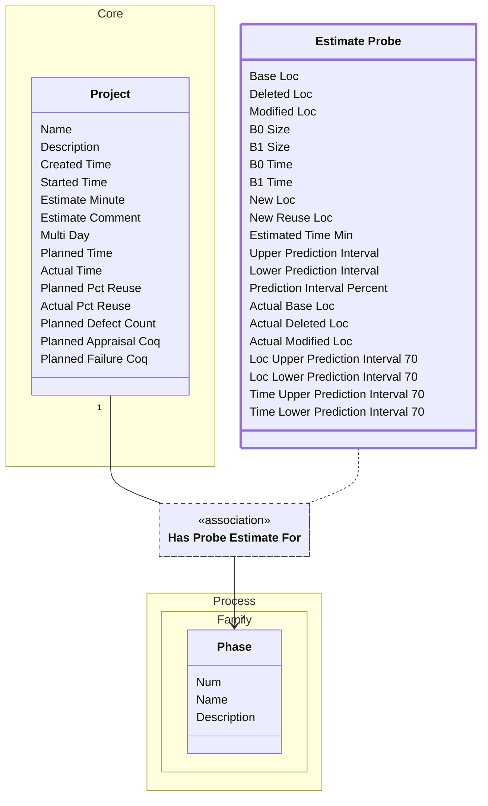

[⇦ Development Process](model.md) / [Project](domain-domain.project.md) / [Estimation](subdomain-domain.project.subdomain.estimation.md)

# Estimate Probe

PROBE size and time calculation for a project in a phase. Reifies Project Has Probe Estimate For.

## Attributes

| Name | Rules | Nullable | TLA+ | Comments / Invariants |
| ---- | ----- | -------- | ---- | --------------------- |
| Base Loc | _(unparsed)_ [0 .. unconstrained] at 1 loc | false |  |  |
| Deleted Loc | _(unparsed)_ [0 .. unconstrained] at 1 loc | false |  |  |
| Modified Loc | _(unparsed)_ [0 .. unconstrained] at 1 loc | false |  |  |
| B0 Size | _(unparsed)_ [0 .. unconstrained] at 1 unit | false |  | Size regression intercept. |
| B1 Size | _(unparsed)_ [0 .. unconstrained] at 1 unit | false |  | Size regression slope. |
| B0 Time | _(unparsed)_ [0 .. unconstrained] at 1 unit | false |  | Time regression intercept. |
| B1 Time | _(unparsed)_ [0 .. unconstrained] at 1 unit | false |  | Time regression slope. |
| New Loc | _(unparsed)_ [0 .. unconstrained] at 1 loc | false |  |  |
| New Reuse Loc | _(unparsed)_ [0 .. unconstrained] at 1 loc | false |  |  |
| Estimated Time Min | _(unparsed)_ [0 .. unconstrained] at 1 minute | false |  |  |
| Upper Prediction Interval | _(unparsed)_ [0 .. unconstrained] at 1 unit | false |  |  |
| Lower Prediction Interval | _(unparsed)_ [0 .. unconstrained] at 1 unit | false |  |  |
| Prediction Interval Percent | _(unparsed)_ [0 .. 100] at 1 percent | false |  |  |
| Actual Base Loc | _(unparsed)_ [0 .. unconstrained] at 1 loc | false |  | SQL column acual_base_loc. |
| Actual Deleted Loc | _(unparsed)_ [0 .. unconstrained] at 1 loc | false |  | SQL column acual_deleted_loc. |
| Actual Modified Loc | _(unparsed)_ [0 .. unconstrained] at 1 loc | false |  | SQL column acual_modified_loc. |
| Loc Upper Prediction Interval 70 | _(unparsed)_ [0 .. unconstrained] at 1 loc | false |  |  |
| Loc Lower Prediction Interval 70 | _(unparsed)_ [0 .. unconstrained] at 1 loc | false |  |  |
| Time Upper Prediction Interval 70 | _(unparsed)_ [0 .. unconstrained] at 1 minute | false |  |  |
| Time Lower Prediction Interval 70 | _(unparsed)_ [0 .. unconstrained] at 1 minute | false |  |  |

## Relations

The classes in this diagram.

- **[Estimate Probe](class-domain.project.subdomain.estimation.class.estimate_probe.md).** PROBE size and time calculation for a project in a phase.
- **[Process::Family::Phase](class-domain.process.subdomain.family.class.phase.md).** Fundamental phase skeleton for a process family.
- **[Core::Project](class-domain.project.subdomain.core.class.project.md).** Work that follows a process.

# State Machine

## State and Event Descriptions

The states for this class.

*None*

The events for this class.

*None*

## Action Specifications

The actions for this class.

*None*

## Query Specifications

The queries for this class.

*None*
