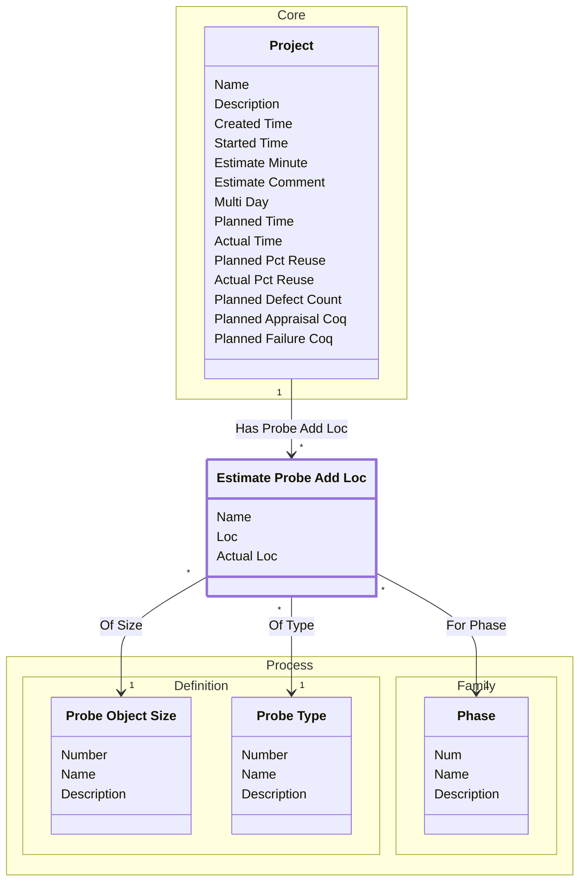

[⇦ Development Process](model.md) / [Project](domain-domain.project.md) / [Estimation](subdomain-domain.project.subdomain.estimation.md)

# Estimate Probe Add Loc

An added-object line in a PROBE size estimate.

## Attributes

| Name | Rules | Nullable | TLA+ | Comments / Invariants |
| ---- | ----- | -------- | ---- | --------------------- |
| Name | _(unparsed)_ unconstrained | false |  |  |
| Loc | _(unparsed)_ [0 .. unconstrained] at 1 loc | false |  |  |
| Actual Loc | _(unparsed)_ [0 .. unconstrained] at 1 loc | false |  | SQL column acual_loc. |

## Relations

The classes in this diagram.

- **[Estimate Probe Add Loc](class-domain.project.subdomain.estimation.class.estimate_probe_add_loc.md).** An added-object line in a PROBE size estimate.
- **[Process::Family::Phase](class-domain.process.subdomain.family.class.phase.md).** Fundamental phase skeleton for a process family.
- **[Process::Definition::Probe Object Size](class-domain.process.subdomain.definition.class.probe_object_size.md).** A relative size category used when estimating objects with PROBE.
- **[Process::Definition::Probe Type](class-domain.process.subdomain.definition.class.probe_type.md).** A PROBE object-type category used when listing added and new objects.
- **[Core::Project](class-domain.project.subdomain.core.class.project.md).** Work that follows a process.

# State Machine

## State and Event Descriptions

The states for this class.

*None*

The events for this class.

*None*

## Action Specifications

The actions for this class.

*None*

## Query Specifications

The queries for this class.

*None*
