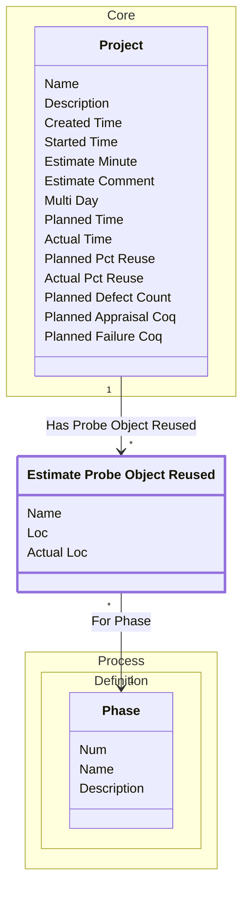

[⇦ Development Process](model.md) / [Project](domain-domain.project.md) / [Estimation](subdomain-domain.project.subdomain.estimation.md)

# Estimate Probe Object Reused

A reused-object line in a PROBE size estimate.

## Attributes

| Name | Rules | Nullable | TLA+ | Comments / Invariants |
| ---- | ----- | -------- | ---- | --------------------- |
| Name | _(unparsed)_ unconstrained | false |  |  |
| Loc | _(unparsed)_ [0 .. unconstrained] at 1 loc | false |  |  |
| Actual Loc | _(unparsed)_ [0 .. unconstrained] at 1 loc | false |  | SQL column acual_loc. |

## Relations

The classes in this diagram.

- **[Estimate Probe Object Reused](class-domain.project.subdomain.estimation.class.estimate_probe_object_reused.md).** A reused-object line in a PROBE size estimate.
- **[Process::Definition::Phase](class-domain.process.subdomain.definition.class.phase.md).** Fundamental phase skeleton for a process family.
- **[Core::Project](class-domain.project.subdomain.core.class.project.md).** Work that follows a process.

# State Machine

## State and Event Descriptions

The states for this class.

*None*

The events for this class.

*None*

## Action Specifications

The actions for this class.

*None*

## Query Specifications

The queries for this class.

*None*
