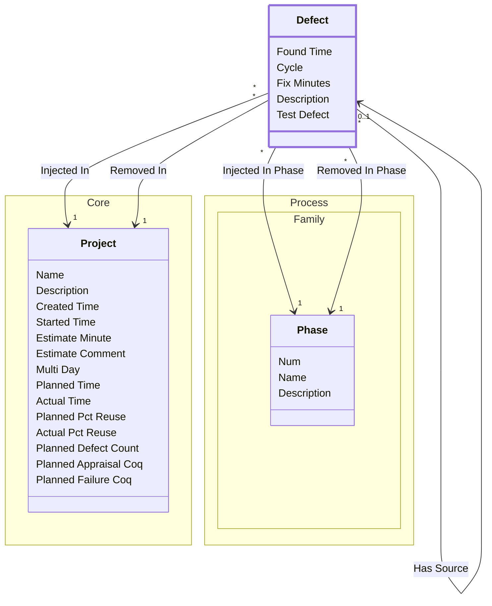

[⇦ Development Process](model.md) / [Project](domain-domain.project.md) / [Quality](subdomain-domain.project.subdomain.quality.md)

# Defect

A defect injected and removed in projects and phases.

## Attributes

| Name | Rules | Nullable | TLA+ | Comments / Invariants |
| ---- | ----- | -------- | ---- | --------------------- |
| Found Time | _(unparsed)_ datetime | false |  |  |
| Cycle | _(unparsed)_ [0 .. unconstrained] at 1 unit | false |  |  |
| Fix Minutes | _(unparsed)_ [0 .. unconstrained] at 1 minute | false |  |  |
| Description | _(unparsed)_ unconstrained | false |  |  |
| Test Defect | _(unparsed)_ unconstrained | false |  | A defect in a test itself. |

## Relations

The classes in this diagram.

- **[Defect](class-domain.project.subdomain.quality.class.defect.md).** A defect injected and removed in projects and phases.
- **[Process::Family::Phase](class-domain.process.subdomain.family.class.phase.md).** Fundamental phase skeleton for a process family.
- **[Core::Project](class-domain.project.subdomain.core.class.project.md).** Work that follows a process.

# State Machine

## State and Event Descriptions

The states for this class.

*None*

The events for this class.

*None*

## Action Specifications

The actions for this class.

*None*

## Query Specifications

The queries for this class.

*None*
