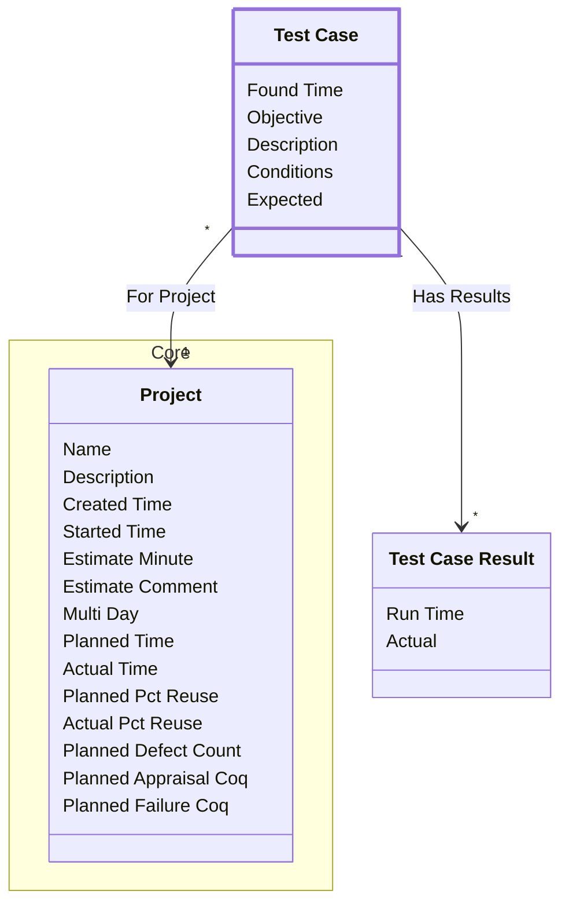

[⇦ Development](model.md) / [Project](domain-domain.project.md) / [Quality](subdomain-domain.project.subdomain.quality.md)

# Test Case

A test case defined for a project.

## Attributes

| Name | Rules | Nullable | TLA+ | Comments / Invariants |
| ---- | ----- | -------- | ---- | --------------------- |
| Found Time | _(unparsed)_ datetime | false |  |  |
| Objective | _(unparsed)_ unconstrained | false |  |  |
| Description | _(unparsed)_ unconstrained | true |  |  |
| Conditions | _(unparsed)_ unconstrained | false |  |  |
| Expected | _(unparsed)_ unconstrained | false |  |  |

## Relations

The classes in this diagram.

- **[Core::Project](class-domain.project.subdomain.core.class.project.md).** Work that follows a process.
- **[Test Case](class-domain.project.subdomain.quality.class.test_case.md).** A test case defined for a project.
- **[Test Case Result](class-domain.project.subdomain.quality.class.test_case_result.md).** A recorded run of a test case.

# State Machine

## State and Event Descriptions

The states for this class.

*None*

The events for this class.

*None*

## Action Specifications

The actions for this class.

*None*

## Query Specifications

The queries for this class.

*None*
