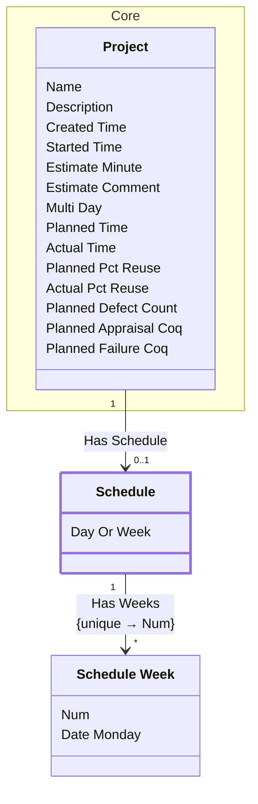

[⇦ Development](model.md) / [Project](domain-domain.project.md) / [Schedule](subdomain-domain.project.subdomain.schedule.md)

# Schedule

The planned calendar for a project, in days or weeks.

## Attributes

| Name | Rules | Nullable | TLA+ | Comments / Invariants |
| ---- | ----- | -------- | ---- | --------------------- |
| Day Or Week | _(unparsed)_ enum of day, week | false |  | Whether the schedule is recorded by day or by week. |

## Relations

The classes in this diagram.

- **[Core::Project](class-domain.project.subdomain.core.class.project.md).** Work that follows a process.
- **[Schedule](class-domain.project.subdomain.schedule.class.schedule.md).** The planned calendar for a project, in days or weeks.
- **[Schedule Week](class-domain.project.subdomain.schedule.class.schedule_week.md).** One week (or day slot) on a project schedule.

# State Machine

## State and Event Descriptions

The states for this class.

*None*

The events for this class.

*None*

## Action Specifications

The actions for this class.

*None*

## Query Specifications

The queries for this class.

*None*
