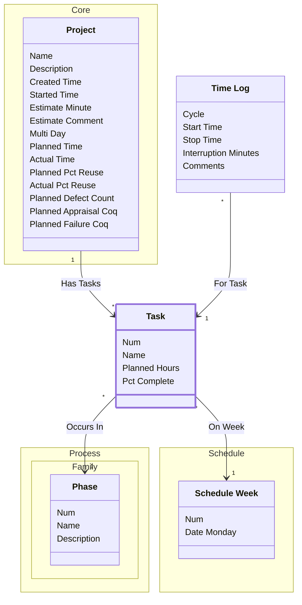

[⇦ Development Process](model.md) / [Project](domain-domain.project.md) / [Task](subdomain-domain.project.subdomain.task.md)

# Task

A planned task on a project, assigned to a phase and a schedule week.

## Attributes

| Name | Rules | Nullable | TLA+ | Comments / Invariants |
| ---- | ----- | -------- | ---- | --------------------- |
| Num | _(unparsed)_ [0 .. unconstrained] at 1 unit | false |  |  |
| Name | _(unparsed)_ unconstrained | false |  |  |
| Planned Hours | _(unparsed)_ [0 .. unconstrained] at 1 hour | false |  |  |
| Pct Complete | _(unparsed)_ [0 .. 100] at 1 percent | false |  |  |

## Relations

The classes in this diagram.

- **[Process::Family::Phase](class-domain.process.subdomain.family.class.phase.md).** Fundamental phase skeleton for a process family.
- **[Core::Project](class-domain.project.subdomain.core.class.project.md).** Work that follows a process.
- **[Schedule::Schedule Week](class-domain.project.subdomain.schedule.class.schedule_week.md).** One week (or day slot) on a project schedule.
- **[Task](class-domain.project.subdomain.task.class.task.md).** A planned task on a project, assigned to a phase and a schedule week.
- **[Time Log](class-domain.project.subdomain.task.class.time_log.md).** A recorded interval of work on a project.

# State Machine

## State and Event Descriptions

The states for this class.

*None*

The events for this class.

*None*

## Action Specifications

The actions for this class.

*None*

## Query Specifications

The queries for this class.

*None*
