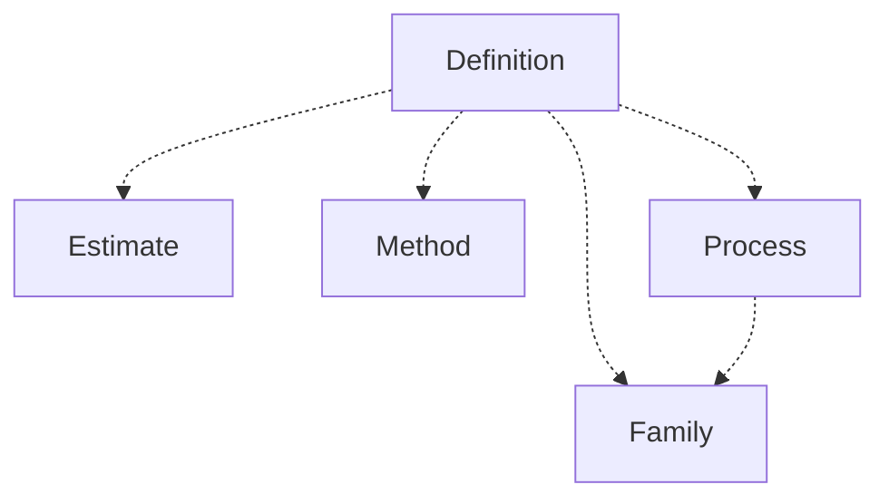

[⇦ Development Process](model.md)

# Process

The definition of a process: families, scripts, methods, templates, and family-level estimates.

## Subdomains

The subdomains of this domain.

- **[Definition](subdomain-domain.process.subdomain.definition.md).** Templates and PROBE catalogs used when following a process.
- **[Estimate](subdomain-domain.process.subdomain.estimate.md).** Programming methods used when estimating size and time.
- **[Family](subdomain-domain.process.subdomain.family.md).** A process family and the phases, defect types, and languages that belong to it.
- **[Method](subdomain-domain.process.subdomain.method.md).** Design templates used when planning a project or module.
- **[Process](subdomain-domain.process.subdomain.process.md).** A versioned process: scripts and steps a family follows.

