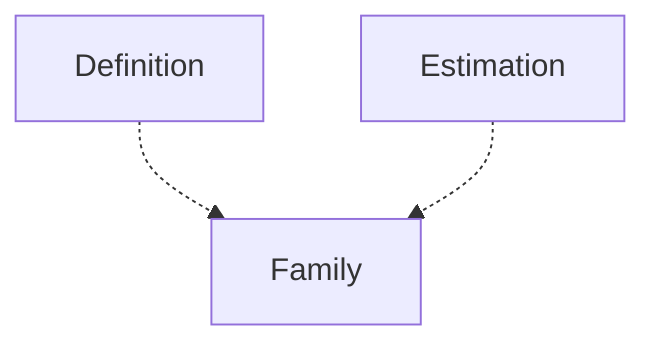

[⇦ Development Process](model.md)

# Process

The definition of a process: families, scripts, methods, templates, and family-level estimates.

## Subdomains

The subdomains of this domain.

- **[Definition](subdomain-domain.process.subdomain.definition.md).** Processes, scripts, methods, and templates that a family uses.
- **[Estimation](subdomain-domain.process.subdomain.estimation.md).** Family-level size and time estimates, including prior versions of each estimate.
- **[Family](subdomain-domain.process.subdomain.family.md).** A process family and the phases, defect types, and languages that belong to it.

