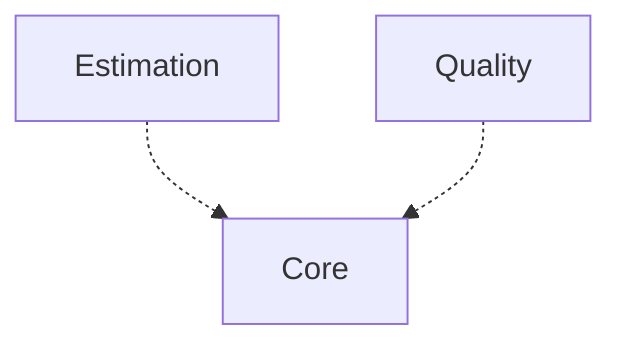

[⇦ Development Process](model.md)

# Project

Data recorded for a running project that follows a process.

## Subdomains

The subdomains of this domain.

- **[Core](subdomain-domain.project.subdomain.core.md).** A running project: parts, cycles, schedule, tasks, and time logs.
- **[Estimation](subdomain-domain.project.subdomain.estimation.md).** Lines-of-code accounts and PROBE calculations recorded on a running project.
- **[Quality](subdomain-domain.project.subdomain.quality.md).** Defects, issues, process improvement proposals, and test cases recorded against projects.

