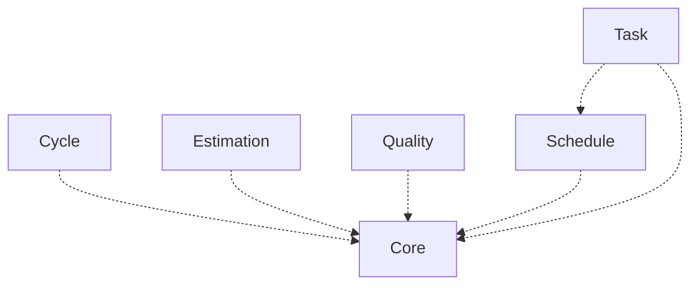

[⇦ Development Process](model.md)

# Project

Data recorded for a running project that follows a process.

## Subdomains

The subdomains of this domain.

- **[Core](subdomain-domain.project.subdomain.core.md).** A running project and its parts.
- **[Cycle](subdomain-domain.project.subdomain.cycle.md).** Planned and actual values recorded per project cycle.
- **[Estimation](subdomain-domain.project.subdomain.estimation.md).** Size and time estimates, lines-of-code accounts, and PROBE calculations.
- **[Quality](subdomain-domain.project.subdomain.quality.md).** Defects, issues, process improvement proposals, and test cases recorded against projects.
- **[Schedule](subdomain-domain.project.subdomain.schedule.md).** The planned calendar for a project, in days or weeks.
- **[Task](subdomain-domain.project.subdomain.task.md).** Planned tasks and recorded time logs on a project.

