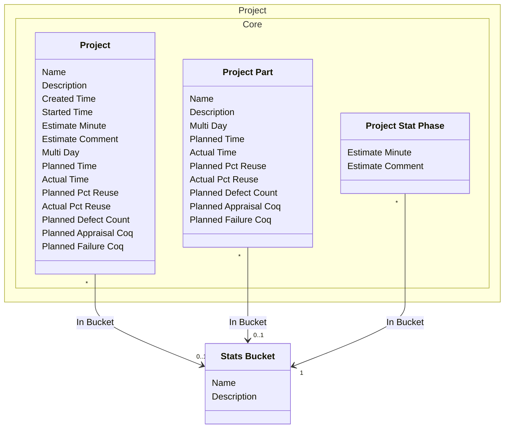

[⇦ Development Process](model.md)

# Statistics

Buckets used to group project statistics.

## Default

Statistics buckets.

## Classes

The classes of this domain.

- **[Stats Bucket](class-domain.statistics.subdomain.default.class.stats_bucket.md).** A bucket used to group project statistics.
- **[Project::Core::Project](class-domain.project.subdomain.core.class.project.md).** Work that follows a process.
- **[Project::Core::Project Part](class-domain.project.subdomain.core.class.project_part.md).** A language-specific part of a project.
- **[Project::Core::Project Stat Phase](class-domain.project.subdomain.core.class.project_stat_phase.md).** A per-phase statistical estimate on a project. stat_phase is Phase; bucket is Stats Bucket.

[Model facts](subdomain-domain.statistics.subdomain.default-facts.md)

## Use Cases

