[⇦ Development Process](model.md) / [Process](domain-domain.process.md)

# Definition

Processes, scripts, methods, and templates that a family uses.
## Classes

The classes of this subdomain.

```mermaid
---
config:
  class:
    hideEmptyMembersBox: true
---
classDiagram
class class_domain_process_subdomain_definition_class_design_method["Design Method"] {
        Name
        Description
    }
class class_domain_process_subdomain_definition_class_method["Method"] {
        Name [key]
        Description
    }
class class_domain_process_subdomain_definition_class_module_template["Module Template"] {
        Name
        Description
    }
class class_domain_process_subdomain_definition_class_probe_object_size["Probe Object Size"] {
        Number
        Name
        Description
    }
class class_domain_process_subdomain_definition_class_probe_object_type["Probe Object Type"] {
        Number
        Name
        Description
    }
class class_domain_process_subdomain_definition_class_probe_type["Probe Type"] {
        Number
        Name
        Description
    }
class class_domain_process_subdomain_definition_class_process["Process"] {
        Name
        Version
        Version Minor
        Purpose
        Entry Criteria
        Exit Criteria
        Script Lock
        Size Unit
        Size K Unit
    }
class class_domain_process_subdomain_definition_class_script["Script"] {
        Num
        Name
        Task Summary
        Purpose
        Entry Criteria
        Exit Criteria
        Cycle
    }
class class_domain_process_subdomain_definition_class_stats_bucket["Stats Bucket"] {
        Name
        Description
    }
class class_domain_process_subdomain_definition_class_step["Step"] {
        Num
        Name
        Tasks
    }
namespace Family {
class class_domain_process_subdomain_family_class_family["Family"] {
            Name [key]
            Description
        }
class class_domain_process_subdomain_family_class_language["Language"] {
            Name
            Description
        }
class class_domain_process_subdomain_family_class_phase["Phase"] {
            Num
            Name
            Description
        }
}
namespace Project.Core {
class class_domain_project_subdomain_core_class_project["Project"] {
            Name
            Description
            Created Time
            Started Time
            Estimate Minute
            Estimate Comment
            Multi Day
            Planned Time
            Actual Time
            Planned Pct Reuse
            Actual Pct Reuse
            Planned Defect Count
            Planned Appraisal Coq
            Planned Failure Coq
        }
class class_domain_project_subdomain_core_class_project_cycle_actual["Project Cycle Actual"] {
            Num
            Actual Pct Reuse
        }
class class_domain_project_subdomain_core_class_project_cycle_plan["Project Cycle Plan"] {
            Num
            Planned Pct Reuse
        }
class class_domain_project_subdomain_core_class_project_part["Project Part"] {
            Name
            Description
            Multi Day
            Planned Time
            Actual Time
            Planned Pct Reuse
            Actual Pct Reuse
            Planned Defect Count
            Planned Appraisal Coq
            Planned Failure Coq
        }
class class_domain_project_subdomain_core_class_project_stat_phase["Project Stat Phase"] {
            Estimate Minute
            Estimate Comment
        }
}
namespace Project.Estimation {
class class_domain_project_subdomain_estimation_class_estimate_probe_add_loc["Estimate Probe Add Loc"] {
            Name
            Loc
            Actual Loc
        }
class class_domain_project_subdomain_estimation_class_estimate_probe_object_loc["Estimate Probe Object Loc"] {
            Name
            Loc Per Method
            Actual Loc
            For Reuse
        }
}
namespace Project.Quality {
class class_domain_project_subdomain_quality_class_pip["Process Improvement Proposal"] {
            Found Time
            Problem
            Proposal
            Resolved Time
        }
}
class_domain_project_subdomain_core_class_project "*" --> "1" class_domain_process_subdomain_definition_class_design_method : Uses Design Method
class_domain_project_subdomain_core_class_project "*" --> "1" class_domain_process_subdomain_definition_class_method : Uses Size Estimation Method
class_domain_project_subdomain_core_class_project "*" --> "1" class_domain_process_subdomain_definition_class_method : Uses Time Estimation Method
class_domain_project_subdomain_core_class_project "*" --> "1" class_domain_process_subdomain_definition_class_module_template : Instantiates
class_domain_project_subdomain_core_class_project "*" --> "1" class_domain_process_subdomain_definition_class_process : Follows Process
class_domain_project_subdomain_core_class_project "*" --> "0..1" class_domain_process_subdomain_definition_class_stats_bucket : In Bucket
class_domain_project_subdomain_core_class_project "*" --> "0..1" class_domain_process_subdomain_definition_class_step : Current Subphase
class_domain_project_subdomain_core_class_project_cycle_actual "*" --> "1" class_domain_process_subdomain_definition_class_module_template : Instantiates
class_domain_project_subdomain_core_class_project_cycle_plan "*" --> "1" class_domain_process_subdomain_definition_class_module_template : Instantiates
class_domain_project_subdomain_core_class_project_part "*" --> "1" class_domain_process_subdomain_definition_class_design_method : Uses Design Method
class_domain_project_subdomain_core_class_project_part "*" --> "1" class_domain_process_subdomain_definition_class_method : Uses Size Estimation Method
class_domain_project_subdomain_core_class_project_part "*" --> "1" class_domain_process_subdomain_definition_class_method : Uses Time Estimation Method
class_domain_project_subdomain_core_class_project_part "*" --> "1" class_domain_process_subdomain_definition_class_module_template : Instantiates
class_domain_project_subdomain_core_class_project_part "*" --> "0..1" class_domain_process_subdomain_definition_class_stats_bucket : In Bucket
class_domain_project_subdomain_core_class_project_part "*" --> "0..1" class_domain_process_subdomain_definition_class_step : Current Subphase
class_domain_project_subdomain_core_class_project_stat_phase "*" --> "0..1" class_domain_process_subdomain_definition_class_method : Uses Method
class_domain_project_subdomain_core_class_project_stat_phase "*" --> "1" class_domain_process_subdomain_definition_class_stats_bucket : In Bucket
class_domain_project_subdomain_estimation_class_estimate_probe_add_loc "*" --> "1" class_domain_process_subdomain_definition_class_probe_object_size : Of Size
class_domain_project_subdomain_estimation_class_estimate_probe_add_loc "*" --> "1" class_domain_process_subdomain_definition_class_probe_type : Of Type
class_domain_project_subdomain_estimation_class_estimate_probe_object_loc "*" --> "1" class_domain_process_subdomain_definition_class_probe_object_size : Of Size
class_domain_project_subdomain_estimation_class_estimate_probe_object_loc "*" --> "1" class_domain_process_subdomain_definition_class_probe_type : Of Type
class_domain_project_subdomain_quality_class_pip "*" --> "1" class_domain_process_subdomain_definition_class_process : On Process
class_domain_project_subdomain_quality_class_pip "*" --> "1" class_domain_process_subdomain_definition_class_process : Resolved In Process
class_domain_project_subdomain_quality_class_pip "*" --> "1" class_domain_process_subdomain_definition_class_step : On Subphase
class_domain_process_subdomain_definition_class_module_template "*" --> "1" class_domain_process_subdomain_family_class_language : Uses Language
class_domain_process_subdomain_definition_class_step "*" --> "1" class_domain_process_subdomain_family_class_phase : Occurs In
class_domain_process_subdomain_family_class_family "1" --> "*" class_domain_process_subdomain_definition_class_process : Has Processes<br/>{unique → Name, Version, Version Minor}
class_domain_process_subdomain_definition_class_module_template "*" --> "1" class_domain_process_subdomain_definition_class_design_method : Uses Design Method
class_domain_process_subdomain_definition_class_module_template "*" --> "1" class_domain_process_subdomain_definition_class_method : Uses Size Estimation Method
class_domain_process_subdomain_definition_class_module_template "*" --> "1" class_domain_process_subdomain_definition_class_method : Uses Time Estimation Method
class_domain_process_subdomain_definition_class_module_template "*" --> "0..1" class_domain_process_subdomain_definition_class_process : Follows Process
class_domain_process_subdomain_definition_class_process "*" --> "0..1" class_domain_process_subdomain_definition_class_process : Has Ancestor
class_domain_process_subdomain_definition_class_process "1" --> "*" class_domain_process_subdomain_definition_class_script : Has Scripts<br/>{unique → Num}
class_domain_process_subdomain_definition_class_script "1" --> "*" class_domain_process_subdomain_definition_class_step : Has Steps<br/>{unique → Num}

```

- **[Design Method](class-domain.process.subdomain.definition.class.design_method.md).** A design template used when planning a project or module.
- **[Method](class-domain.process.subdomain.definition.class.method.md).** A programming method used when recording phase statistics for a project.
- **[Module Template](class-domain.process.subdomain.definition.class.module_template.md).** Shared configuration for projects (and project parts) that follow a process.
- **[Probe Object Size](class-domain.process.subdomain.definition.class.probe_object_size.md).** A relative size category used when estimating objects with PROBE.
- **[Probe Object Type](class-domain.process.subdomain.definition.class.probe_object_type.md).** A kind of object used when estimating with PROBE.
- **[Probe Type](class-domain.process.subdomain.definition.class.probe_type.md).** A PROBE object-type category used when listing added and new objects.
- **[Process](class-domain.process.subdomain.definition.class.process.md).** A versioned process to follow, owned by a family.
- **[Script](class-domain.process.subdomain.definition.class.script.md).** A step-by-step process script owned by a process.
- **[Stats Bucket](class-domain.process.subdomain.definition.class.stats_bucket.md).** A bucket used to group project statistics.
- **[Step](class-domain.process.subdomain.definition.class.step.md).** A step of a process script.
- **[Project::Estimation::Estimate Probe Add Loc](class-domain.project.subdomain.estimation.class.estimate_probe_add_loc.md).** An added-object line in a PROBE size estimate.
- **[Project::Estimation::Estimate Probe Object Loc](class-domain.project.subdomain.estimation.class.estimate_probe_object_loc.md).** A new-object line in a PROBE size estimate.
- **[Family::Family](class-domain.process.subdomain.family.class.family.md).** Core partitioning of the catalog.
- **[Family::Language](class-domain.process.subdomain.family.class.language.md).** A programming language used when estimating size or time in a process family.
- **[Family::Phase](class-domain.process.subdomain.family.class.phase.md).** Fundamental phase skeleton for a process family.
- **[Project::Quality::Process Improvement Proposal](class-domain.project.subdomain.quality.class.pip.md).** A process improvement proposal raised on a project.
- **[Project::Core::Project](class-domain.project.subdomain.core.class.project.md).** Work that follows a process.
- **[Project::Core::Project Cycle Actual](class-domain.project.subdomain.core.class.project_cycle_actual.md).** Actual recording values for one cycle of a project.
- **[Project::Core::Project Cycle Plan](class-domain.project.subdomain.core.class.project_cycle_plan.md).** Planned recording values for one cycle of a project.
- **[Project::Core::Project Part](class-domain.project.subdomain.core.class.project_part.md).** A language-specific part of a project.
- **[Project::Core::Project Stat Phase](class-domain.project.subdomain.core.class.project_stat_phase.md).** A per-phase statistical estimate on a project. stat_phase is Phase; bucket is Stats Bucket.

[Model facts](subdomain-domain.process.subdomain.definition-facts.md)

## Use Cases

