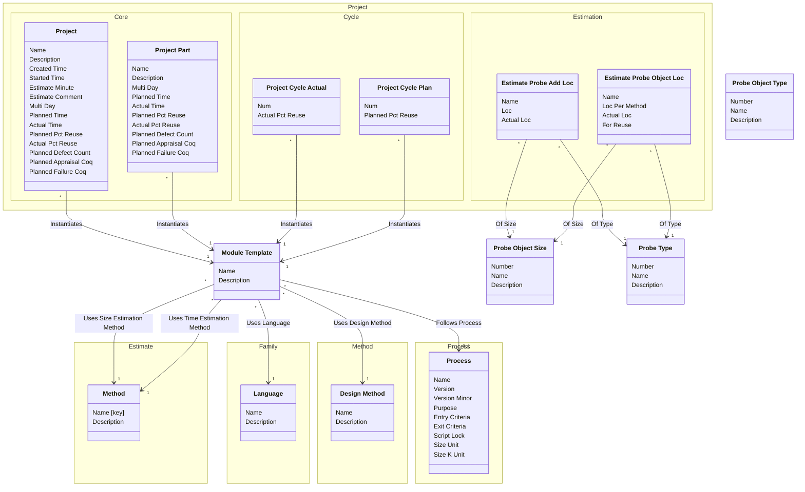

[⇦ Development Process](model.md) / [Process](domain-domain.process.md)

# Definition

Templates and PROBE catalogs used when following a process.
## Classes

The classes of this subdomain.

- **[Module Template](class-domain.process.subdomain.definition.class.module_template.md).** Shared configuration for projects (and project parts) that follow a process.
- **[Probe Object Size](class-domain.process.subdomain.definition.class.probe_object_size.md).** A relative size category used when estimating objects with PROBE.
- **[Probe Object Type](class-domain.process.subdomain.definition.class.probe_object_type.md).** A kind of object used when estimating with PROBE.
- **[Probe Type](class-domain.process.subdomain.definition.class.probe_type.md).** A PROBE object-type category used when listing added and new objects.
- **[Method::Design Method](class-domain.process.subdomain.method.class.design_method.md).** A design template used when planning a project or module.
- **[Project::Estimation::Estimate Probe Add Loc](class-domain.project.subdomain.estimation.class.estimate_probe_add_loc.md).** An added-object line in a PROBE size estimate.
- **[Project::Estimation::Estimate Probe Object Loc](class-domain.project.subdomain.estimation.class.estimate_probe_object_loc.md).** A new-object line in a PROBE size estimate.
- **[Family::Language](class-domain.process.subdomain.family.class.language.md).** A programming language used when estimating size or time in a process family.
- **[Estimate::Method](class-domain.process.subdomain.estimate.class.method.md).** A programming method used when recording phase statistics for a project.
- **[Process::Process](class-domain.process.subdomain.process.class.process.md).** A versioned process to follow, owned by a family.
- **[Project::Core::Project](class-domain.project.subdomain.core.class.project.md).** Work that follows a process.
- **[Project::Cycle::Project Cycle Actual](class-domain.project.subdomain.cycle.class.project_cycle_actual.md).** Actual recording values for one cycle of a project.
- **[Project::Cycle::Project Cycle Plan](class-domain.project.subdomain.cycle.class.project_cycle_plan.md).** Planned recording values for one cycle of a project.
- **[Project::Core::Project Part](class-domain.project.subdomain.core.class.project_part.md).** A language-specific part of a project.

[Model facts](subdomain-domain.process.subdomain.definition-facts.md)

## Use Cases

