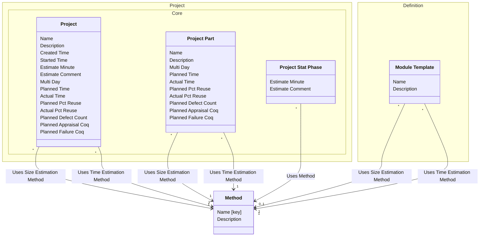

[⇦ Development Process](model.md) / [Process](domain-domain.process.md)

# Estimate

Programming methods used when estimating size and time.
## Classes

The classes of this subdomain.

- **[Method](class-domain.process.subdomain.estimate.class.method.md).** A programming method used when recording phase statistics for a project.
- **[Definition::Module Template](class-domain.process.subdomain.definition.class.module_template.md).** Shared configuration for projects (and project parts) that follow a process.
- **[Project::Core::Project](class-domain.project.subdomain.core.class.project.md).** Work that follows a process.
- **[Project::Core::Project Part](class-domain.project.subdomain.core.class.project_part.md).** A language-specific part of a project.
- **[Project::Core::Project Stat Phase](class-domain.project.subdomain.core.class.project_stat_phase.md).** A per-phase statistical estimate on a project. stat_phase is Phase; bucket is Stats Bucket.

[Model facts](subdomain-domain.process.subdomain.estimate-facts.md)

## Use Cases

