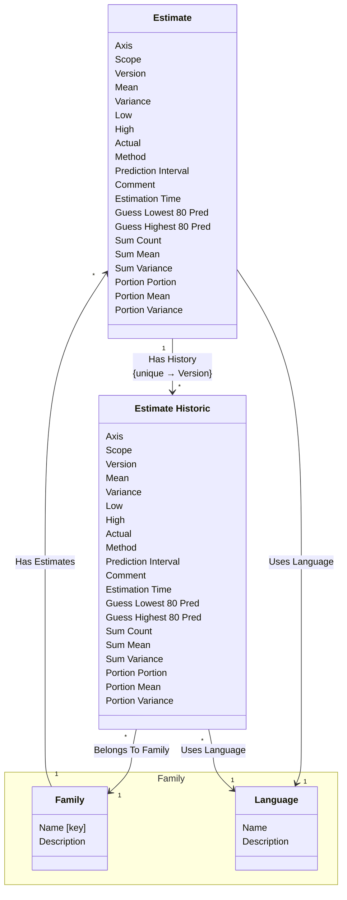

[⇦ Development Process](model.md) / [Process](domain-domain.process.md)

# Estimation

Family-level size and time estimates, including prior versions of each estimate.
## Classes

The classes of this subdomain.

- **[Estimate](class-domain.process.subdomain.estimation.class.estimate.md).** An estimate of size or time, categorized by family, language, axis, and scope.
- **[Estimate Historic](class-domain.process.subdomain.estimation.class.estimate_historic.md).** A stored prior iteration of an estimate.
- **[Family::Family](class-domain.process.subdomain.family.class.family.md).** Core partitioning of the catalog.
- **[Family::Language](class-domain.process.subdomain.family.class.language.md).** A programming language used when estimating size or time in a process family.

[Model facts](subdomain-domain.process.subdomain.estimation-facts.md)

## Use Cases

