[⇦ Development Process](model.md) / [Process](domain-domain.process.md)

# Family

A process family and the phases, defect types, and languages that belong to it.
## Classes

The classes of this subdomain.

```mermaid
---
config:
  class:
    hideEmptyMembersBox: true
---
classDiagram
class class_domain_process_subdomain_family_class_defect_type["Defect Type"] {
        Num
        Name
        Description
        Base Num
    }
class class_domain_process_subdomain_family_class_family["Family"] {
        Name [key]
        Description
    }
class class_domain_process_subdomain_family_class_language["Language"] {
        Name
        Description
    }
class class_domain_process_subdomain_family_class_phase["Phase"] {
        Num
        Name
        Description
    }
namespace Definition {
class class_domain_process_subdomain_definition_class_module_template["Module Template"] {
            Name
            Description
        }
}
namespace Process {
class class_domain_process_subdomain_process_class_process["Process"] {
            Name
            Version
            Version Minor
            Purpose
            Entry Criteria
            Exit Criteria
            Script Lock
            Size Unit
            Size K Unit
        }
class class_domain_process_subdomain_process_class_step["Step"] {
            Num
            Name
            Tasks
        }
}
namespace Project.Core {
class class_domain_project_subdomain_core_class_phase_products_check["Phase Products Check"] {
            Satisfied
        }
class class_domain_project_subdomain_core_class_project["Project"] {
            Name
            Description
            Created Time
            Started Time
            Estimate Minute
            Estimate Comment
            Multi Day
            Planned Time
            Actual Time
            Planned Pct Reuse
            Actual Pct Reuse
            Planned Defect Count
            Planned Appraisal Coq
            Planned Failure Coq
        }
class class_domain_project_subdomain_core_class_project_part["Project Part"] {
            Name
            Description
            Multi Day
            Planned Time
            Actual Time
            Planned Pct Reuse
            Actual Pct Reuse
            Planned Defect Count
            Planned Appraisal Coq
            Planned Failure Coq
        }
class class_domain_project_subdomain_core_class_project_stat_phase["Project Stat Phase"] {
            Estimate Minute
            Estimate Comment
        }
}
namespace Project.Estimation {
class class_domain_project_subdomain_estimation_class_actual_loc["Actual Loc"] {
            Cycle
            Base
            New
            Changed
            Added
            Modified
            Deleted
            Reused
            Object Loc
        }
class class_domain_project_subdomain_estimation_class_estimate["Estimate"] {
            Axis
            Scope
            Version
            Mean
            Variance
            Low
            High
            Actual
            Method
            Prediction Interval
            Comment
            Estimation Time
            Guess Lowest 80 Pred
            Guess Highest 80 Pred
            Sum Count
            Sum Mean
            Sum Variance
            Portion Portion
            Portion Mean
            Portion Variance
        }
class class_domain_project_subdomain_estimation_class_estimate_historic["Estimate Historic"] {
            Axis
            Scope
            Version
            Mean
            Variance
            Low
            High
            Actual
            Method
            Prediction Interval
            Comment
            Estimation Time
            Guess Lowest 80 Pred
            Guess Highest 80 Pred
            Sum Count
            Sum Mean
            Sum Variance
            Portion Portion
            Portion Mean
            Portion Variance
        }
class class_domain_project_subdomain_estimation_class_estimate_loc["Estimate Loc"] {
            Base
            New
            Changed
            Added
            Modified
            Deleted
            Reused
            Object Loc
        }
class class_domain_project_subdomain_estimation_class_estimate_probe["Estimate Probe"] {
            Base Loc
            Deleted Loc
            Modified Loc
            B0 Size
            B1 Size
            B0 Time
            B1 Time
            New Loc
            New Reuse Loc
            Estimated Time Min
            Upper Prediction Interval
            Lower Prediction Interval
            Prediction Interval Percent
            Actual Base Loc
            Actual Deleted Loc
            Actual Modified Loc
            Loc Upper Prediction Interval 70
            Loc Lower Prediction Interval 70
            Time Upper Prediction Interval 70
            Time Lower Prediction Interval 70
        }
class class_domain_project_subdomain_estimation_class_estimate_probe_add_loc["Estimate Probe Add Loc"] {
            Name
            Loc
            Actual Loc
        }
class class_domain_project_subdomain_estimation_class_estimate_probe_object_loc["Estimate Probe Object Loc"] {
            Name
            Loc Per Method
            Actual Loc
            For Reuse
        }
class class_domain_project_subdomain_estimation_class_estimate_probe_object_reused["Estimate Probe Object Reused"] {
            Name
            Loc
            Actual Loc
        }
}
namespace Project.Quality {
class class_domain_project_subdomain_quality_class_defect["Defect"] {
            Found Time
            Cycle
            Fix Minutes
            Description
            Test Defect
        }
class class_domain_project_subdomain_quality_class_issue["Issue"] {
            Found Time
            Cycle
            Description
            Resolution Time
            Resolution
        }
class class_domain_project_subdomain_quality_class_pip["Process Improvement Proposal"] {
            Found Time
            Problem
            Proposal
            Resolved Time
        }
}
namespace Project.Task {
class class_domain_project_subdomain_task_class_task["Task"] {
            Num
            Name
            Planned Hours
            Pct Complete
        }
class class_domain_project_subdomain_task_class_time_log["Time Log"] {
            Cycle
            Start Time
            Stop Time
            Interruption Minutes
            Comments
        }
}
class assoc_cassociation_domain_project_subdomain_core_class_project_domain_process_subdomain_family_class_phase_checks_phase_products["Checks Phase Products"]
<<association>> assoc_cassociation_domain_project_subdomain_core_class_project_domain_process_subdomain_family_class_phase_checks_phase_products
class assoc_cassociation_domain_project_subdomain_core_class_project_domain_process_subdomain_family_class_phase_has_probe_estimate_for["Has Probe Estimate For"]
<<association>> assoc_cassociation_domain_project_subdomain_core_class_project_domain_process_subdomain_family_class_phase_has_probe_estimate_for
style assoc_cassociation_domain_project_subdomain_core_class_project_domain_process_subdomain_family_class_phase_checks_phase_products stroke:#333,stroke-dasharray:5 5
style assoc_cassociation_domain_project_subdomain_core_class_project_domain_process_subdomain_family_class_phase_has_probe_estimate_for stroke:#333,stroke-dasharray:5 5
class_domain_process_subdomain_family_class_family "1" --> "*" class_domain_project_subdomain_estimation_class_estimate : Has Estimates
class_domain_project_subdomain_core_class_project "*" --> "1" class_domain_process_subdomain_family_class_language : Uses Language
class_domain_project_subdomain_core_class_project "*" -- assoc_cassociation_domain_project_subdomain_core_class_project_domain_process_subdomain_family_class_phase_checks_phase_products
    assoc_cassociation_domain_project_subdomain_core_class_project_domain_process_subdomain_family_class_phase_checks_phase_products --> "*" class_domain_process_subdomain_family_class_phase
    class_domain_project_subdomain_core_class_phase_products_check .. assoc_cassociation_domain_project_subdomain_core_class_project_domain_process_subdomain_family_class_phase_checks_phase_products
class_domain_project_subdomain_core_class_project "*" --> "0..1" class_domain_process_subdomain_family_class_phase : Current Phase
class_domain_project_subdomain_core_class_project "1" -- assoc_cassociation_domain_project_subdomain_core_class_project_domain_process_subdomain_family_class_phase_has_probe_estimate_for
    assoc_cassociation_domain_project_subdomain_core_class_project_domain_process_subdomain_family_class_phase_has_probe_estimate_for --> "*" class_domain_process_subdomain_family_class_phase
    class_domain_project_subdomain_estimation_class_estimate_probe .. assoc_cassociation_domain_project_subdomain_core_class_project_domain_process_subdomain_family_class_phase_has_probe_estimate_for
class_domain_project_subdomain_core_class_project_part "*" --> "1" class_domain_process_subdomain_family_class_language : Uses Language
class_domain_project_subdomain_core_class_project_part "*" --> "0..1" class_domain_process_subdomain_family_class_phase : Current Phase
class_domain_project_subdomain_core_class_project_stat_phase "*" --> "1" class_domain_process_subdomain_family_class_phase : For Phase
class_domain_project_subdomain_estimation_class_actual_loc "*" --> "1" class_domain_process_subdomain_family_class_phase : For Phase
class_domain_project_subdomain_estimation_class_estimate "*" --> "1" class_domain_process_subdomain_family_class_language : Uses Language
class_domain_project_subdomain_estimation_class_estimate_historic "*" --> "1" class_domain_process_subdomain_family_class_family : Belongs To Family
class_domain_project_subdomain_estimation_class_estimate_historic "*" --> "1" class_domain_process_subdomain_family_class_language : Uses Language
class_domain_project_subdomain_estimation_class_estimate_loc "*" --> "1" class_domain_process_subdomain_family_class_phase : For Phase
class_domain_project_subdomain_estimation_class_estimate_probe_add_loc "*" --> "1" class_domain_process_subdomain_family_class_phase : For Phase
class_domain_project_subdomain_estimation_class_estimate_probe_object_loc "*" --> "1" class_domain_process_subdomain_family_class_phase : For Phase
class_domain_project_subdomain_estimation_class_estimate_probe_object_reused "*" --> "1" class_domain_process_subdomain_family_class_phase : For Phase
class_domain_project_subdomain_quality_class_defect "*" --> "1" class_domain_process_subdomain_family_class_phase : Injected In Phase
class_domain_project_subdomain_quality_class_defect "*" --> "1" class_domain_process_subdomain_family_class_phase : Removed In Phase
class_domain_project_subdomain_quality_class_issue "*" --> "1" class_domain_process_subdomain_family_class_phase : Injected In Phase
class_domain_project_subdomain_quality_class_pip "*" --> "1" class_domain_process_subdomain_family_class_phase : On Phase
class_domain_project_subdomain_task_class_task "*" --> "1" class_domain_process_subdomain_family_class_phase : Occurs In
class_domain_project_subdomain_task_class_time_log "*" --> "1" class_domain_process_subdomain_family_class_phase : Occurs In
class_domain_process_subdomain_definition_class_module_template "*" --> "1" class_domain_process_subdomain_family_class_language : Uses Language
class_domain_process_subdomain_family_class_family "1" --> "*" class_domain_process_subdomain_process_class_process : Has Processes<br/>{unique → Name, Version, Version Minor}
class_domain_process_subdomain_process_class_step "*" --> "1" class_domain_process_subdomain_family_class_phase : Occurs In
class_domain_process_subdomain_family_class_family "1" --> "*" class_domain_process_subdomain_family_class_defect_type : Has Defect Types<br/>{unique → Num}
class_domain_process_subdomain_family_class_family "1" --> "*" class_domain_process_subdomain_family_class_language : Has Languages<br/>{unique → Name}
class_domain_process_subdomain_family_class_family "1" --> "*" class_domain_process_subdomain_family_class_phase : Has Phases<br/>{unique → Name}<br/>{unique → Num}

```

- **[Defect Type](class-domain.process.subdomain.family.class.defect_type.md).** A type of defect classified within a process family.
- **[Family](class-domain.process.subdomain.family.class.family.md).** Core partitioning of the catalog.
- **[Language](class-domain.process.subdomain.family.class.language.md).** A programming language used when estimating size or time in a process family.
- **[Phase](class-domain.process.subdomain.family.class.phase.md).** Fundamental phase skeleton for a process family.
- **[Project::Estimation::Actual Loc](class-domain.project.subdomain.estimation.class.actual_loc.md).** Actual lines-of-code account for a project.
- **[Project::Quality::Defect](class-domain.project.subdomain.quality.class.defect.md).** A defect injected and removed in projects and phases.
- **[Project::Estimation::Estimate](class-domain.project.subdomain.estimation.class.estimate.md).** An estimate of size or time, categorized by family, language, axis, and scope.
- **[Project::Estimation::Estimate Historic](class-domain.project.subdomain.estimation.class.estimate_historic.md).** A stored prior iteration of an estimate.
- **[Project::Estimation::Estimate Loc](class-domain.project.subdomain.estimation.class.estimate_loc.md).** Planned lines-of-code account for a project.
- **[Project::Estimation::Estimate Probe](class-domain.project.subdomain.estimation.class.estimate_probe.md).** PROBE size and time calculation for a project in a phase.
- **[Project::Estimation::Estimate Probe Add Loc](class-domain.project.subdomain.estimation.class.estimate_probe_add_loc.md).** An added-object line in a PROBE size estimate.
- **[Project::Estimation::Estimate Probe Object Loc](class-domain.project.subdomain.estimation.class.estimate_probe_object_loc.md).** A new-object line in a PROBE size estimate.
- **[Project::Estimation::Estimate Probe Object Reused](class-domain.project.subdomain.estimation.class.estimate_probe_object_reused.md).** A reused-object line in a PROBE size estimate.
- **[Project::Quality::Issue](class-domain.project.subdomain.quality.class.issue.md).** An issue found in a project phase, with an optional resolution.
- **[Definition::Module Template](class-domain.process.subdomain.definition.class.module_template.md).** Shared configuration for projects (and project parts) that follow a process.
- **[Project::Core::Phase Products Check](class-domain.project.subdomain.core.class.phase_products_check.md).** Whether a project's products for a phase are satisfied.
- **[Process::Process](class-domain.process.subdomain.process.class.process.md).** A versioned process to follow, owned by a family.
- **[Project::Quality::Process Improvement Proposal](class-domain.project.subdomain.quality.class.pip.md).** A process improvement proposal raised on a project.
- **[Project::Core::Project](class-domain.project.subdomain.core.class.project.md).** Work that follows a process.
- **[Project::Core::Project Part](class-domain.project.subdomain.core.class.project_part.md).** A language-specific part of a project.
- **[Project::Core::Project Stat Phase](class-domain.project.subdomain.core.class.project_stat_phase.md).** A per-phase statistical estimate on a project. stat_phase is Phase; bucket is Stats Bucket.
- **[Process::Step](class-domain.process.subdomain.process.class.step.md).** A step of a process script.
- **[Project::Task::Task](class-domain.project.subdomain.task.class.task.md).** A planned task on a project, assigned to a phase and a schedule week.
- **[Project::Task::Time Log](class-domain.project.subdomain.task.class.time_log.md).** A recorded interval of work on a project.

[Model facts](subdomain-domain.process.subdomain.family-facts.md)

## Use Cases

